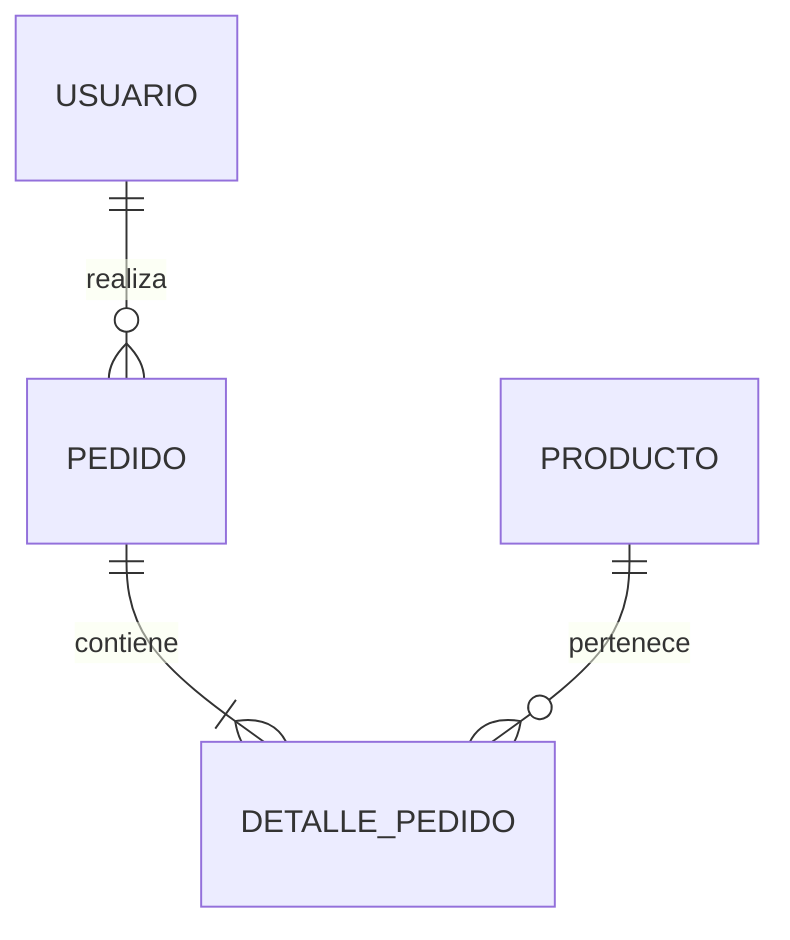

# Inmobiliaria Laboratorio 2

El sistema trata de la informatización de la gestión de alquileres
temporarios de propiedades inmuebles que realiza una agencia
inmobiliaria.

---

## Integrantes del Grupo

* **Emanuel Angel** - *emanuelangelsbr@gmail.com* - [@EmanuelAngel](https://github.com/EmanuelAngel) - Discord: `angel.emanuel`

---

## Modelado de Datos

A continuación se presenta el esquema del modelo de datos correspondiente a la aplicación:

### Diagrama Entidad-Relación (DER) / Diagrama de Clases

> **Nota:** Puedes adjuntar la imagen en el repositorio (por ejemplo, en una carpeta `/docs` o `/img`) y enlazarla como se muestra arriba, o pegar directamente un diagrama generado en Mermaid.

Ver diagrama en código Mermaid (Opcional)

---
