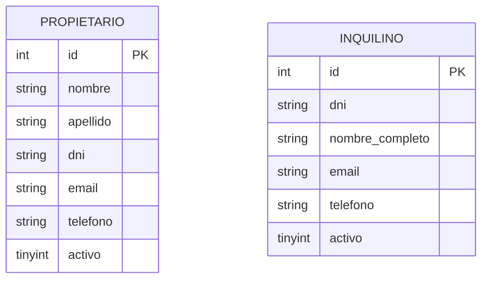

# Inmobiliaria Laboratorio 2

Sistema de informatización para la gestión de alquileres temporarios de propiedades inmuebles.

---

## Integrantes del Grupo

* **Emanuel Angel** - *emanuelangelsbr@gmail.com* - [@EmanuelAngel](https://github.com/EmanuelAngel) - Discord: `angel.emanuel`

---

## Requisitos Previos

- [.NET 10 SDK](https://dotnet.microsoft.com/download)
- [MySQL Server 8.0+](https://dev.mysql.com/downloads/mysql/) (o compatible en puerto `3306`)
- Cliente de línea de comandos de MySQL (`mysql`) o administrador gráfico (DBeaver, MySQL Workbench, phpMyAdmin)

---

## Puesta en Marcha

### 1. Base de Datos

El script [database.sql](database.sql) crea automáticamente la base de datos `inmobiliaria_dev`, las tablas `PROPIETARIO` e `INQUILINO`, e inserta datos semilla de prueba.

#### Vía Terminal (CLI)
Ejecutar desde la raíz del proyecto:

- **Windows (PowerShell / CMD / Git Bash):**
  ```bash
  mysql -u root -p --default-character-set=utf8mb4 < database.sql
  ```
- **Linux / macOS:**
  > **Nota**: No lo probé.

  ```bash
  mysql -u root -p < database.sql
  ```

#### Vía Interfaz Gráfica (Workbench / DBeaver / phpMyAdmin)
1. Abrir el archivo [database.sql](database.sql) en el editor SQL.
2. Ejecutar todo el script (creará el esquema y poblará las tablas automáticamente).

---

### 2. Configuración de Conexión

#### Opción A: Vía User Secrets (Recomendado)
Permite almacenar la cadena de conexión localmente en el perfil de usuario del sistema operativo (fuera del repositorio), sobrescribiendo los valores de `appsettings.json` en tiempo de ejecución. Para más información, consultar la [documentación oficial de Secret Manager en ASP.NET Core](https://learn.microsoft.com/en-us/aspnet/core/security/app-secrets?view=aspnetcore-10.0&tabs=windows%2Cpowershell).

```bash
dotnet user-secrets set "ConnectionStrings:DefaultConnection" "Server=localhost;Database=inmobiliaria_dev;User=root;Password=TU_PASSWORD;"
```

#### Opción B: Vía `appsettings.json`
Modificar directamente la cadena de conexión en [appsettings.json](file:///appsettings.json) (o crear `appsettings.Development.json`):

```json
"ConnectionStrings": {
  "DefaultConnection": "Server=localhost;Database=inmobiliaria_dev;User=root;Password=TU_PASSWORD;"
}
```

> **Nota:** Por defecto el proyecto viene configurado con usuario `root` y sin contraseña (`Password=;`). Si tu servidor local requiere contraseña, configurala con cualquiera de las dos opciones.

---

### 3. Ejecución de la Aplicación

Desde la terminal en la raíz del proyecto:

1. Restaurar dependencias:
   ```bash
   dotnet restore
   ```
2. Iniciar el servidor web:
   ```bash
   dotnet run
   ```
   *(Opcional con recarga: `dotnet watch`)*

3. Abrir en el navegador:
   - **HTTP:** [http://localhost:5093](http://localhost:5093)
   - **HTTPS:** [https://localhost:7047](https://localhost:7047)


---

## Modelado de Datos

### Diagrama Entidad-Relación (DER)


