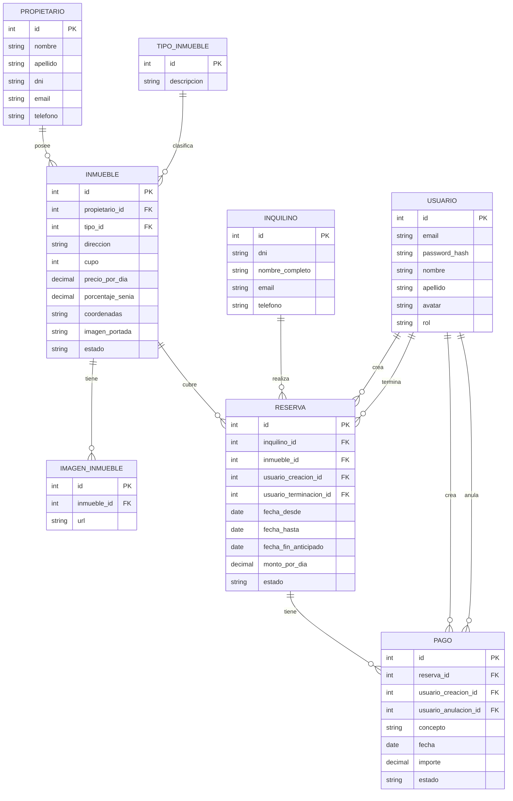

# Inmobiliaria Laboratorio 2

El sistema trata de la informatización de la gestión de alquileres
temporarios de propiedades inmuebles que realiza una agencia
inmobiliaria.

---

## Integrantes del Grupo

* **Emanuel Angel** - *emanuelangelsbr@gmail.com* - [@EmanuelAngel](https://github.com/EmanuelAngel) - Discord: `angel.emanuel`

---

## Modelado de Datos

A continuación se presenta el esquema del modelo de datos correspondiente a la aplicación:

### Diagrama Entidad-Relación (DER)

### Creación e inicialización de la base de datos

**Requisitos:**

- MySQL. Versión utilizada en el proyecto: 8.0.46.0

#### Instrucciones

1. Iniciar una sesión de terminal en la carpeta del proyecto.
2. Ejecutar el comando para crear e inicializar la base de datos.
    - Windows: `mysql -u root -p --default-character-set=utf8mb4 < database.sql`
    - Linux: `mysql -u root -p < database.sql`
3. Ingresar la contraseña del usuario `root` para iniciar el comando de MySQL.

---
