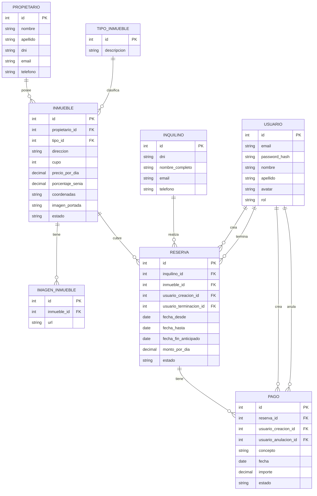

# Diagrama Entidad-Relacion

> Derivado de la [narrativa](../narrativa.md).

---

---

## Descripcion de Entidades

### PROPIETARIO

Dueno de uno o varios inmuebles. Es el cliente que le confia sus propiedades a la agencia. No es usuario del sistema: no tiene acceso a la aplicacion.

**Relaciones:** 1 PROPIETARIO -> N INMUEBLE

| Campo | Tipo | Restricciones | Por que existe / item narrativa |
|-------|------|---------------|---------------------------------|
| id | int | PK, autoincrement | Identificador interno de la tabla |
| nombre | string | NOT NULL | Dato personal basico. La narrativa no especifica campos de propietario; se infieren por analogia con otras entidades |
| apellido | string | NOT NULL | Idem nombre |
| dni | string | NOT NULL | Identificacion unica de la persona |
| email | string | NOT NULL | Dato de contacto para la agencia |
| telefono | string | NOT NULL | Dato de contacto para la agencia |

---

### TIPO_INMUEBLE

Catalogo de tipos posibles para un inmueble: casa, departamento, monoambiente, loft, etc. Existe como tabla separada porque la narrativa pide ABM explicito sobre los tipos, lo que implica que deben ser configurables.

**Relaciones:** 1 TIPO_INMUEBLE -> N INMUEBLE

| Campo | Tipo | Restricciones | Por que existe / item narrativa |
|-------|------|---------------|---------------------------------|
| id | int | PK, autoincrement | Identificador interno de la tabla |
| descripcion | string | NOT NULL, UNIQUE | Nombre del tipo. Item 6: tipo (casa, departamento, monoambiente, loft, etc.). Item 7: se debe poder administrar (ABM) los tipos |

---

### INMUEBLE

La propiedad que se ofrece en alquiler. Es la entidad central del modelo: esta relacionada con propietario, tipo, imagenes y reservas.

**Relaciones:** N INMUEBLE -> 1 PROPIETARIO | N INMUEBLE -> 1 TIPO_INMUEBLE | 1 INMUEBLE -> N IMAGEN_INMUEBLE | 1 INMUEBLE -> N RESERVA

| Campo | Tipo | Restricciones | Por que existe / item narrativa |
|-------|------|---------------|---------------------------------|
| id | int | PK, autoincrement | Identificador interno de la tabla |
| propietario_id | int | FK -> PROPIETARIO, NOT NULL | Item 2: cada inmueble sera propiedad de un unico propietario |
| tipo_id | int | FK -> TIPO_INMUEBLE, NOT NULL | Item 6: la agencia le pide el tipo al registrar el inmueble |
| direccion | string | NOT NULL | Item 6: la agencia le pide la direccion |
| cupo | int | NOT NULL, > 0 | Item 6: la agencia le pide el cupo (cantidad maxima de personas) |
| precio_por_dia | decimal | NOT NULL, > 0 | Item 6: la agencia le pide el precio por dia |
| porcentaje_senia | decimal | NOT NULL, 0-100 | Item 12: los inmuebles establecen el porcentaje de alquiler a pagar al momento de reservar |
| coordenadas | string | nullable | Item 6: la agencia le pide las coordenadas. Campo string único (ej. formato 'latitud,longitud') |
| imagen_portada | string | nullable | Entidades (narrativa): los inmuebles tienen una imagen de portada |
| estado | VARCHAR(20) | NOT NULL, CHECK (estado IN ('Disponible', 'Suspendido')) | Item 8: el propietario puede solicitar suspender temporalmente el inmueble |

---

### IMAGEN_INMUEBLE

Galeria de fotos del inmueble. Separada en tabla propia porque la narrativa indica que un inmueble tiene una imagen de portada Y varias imagenes adicionales, lo que implica una relacion 1 a N con la tabla principal.

**Relaciones:** N IMAGEN_INMUEBLE -> 1 INMUEBLE

| Campo | Tipo | Restricciones | Por que existe / item narrativa |
|-------|------|---------------|---------------------------------|
| id | int | PK, autoincrement | Identificador interno de la tabla |
| inmueble_id | int | FK -> INMUEBLE, NOT NULL | Vinculo con el inmueble al que pertenece la imagen |
| url | string | NOT NULL | Entidades (narrativa): los inmuebles tienen otras varias imagenes del inmueble, ademas de la portada |

---

### INQUILINO

Quien alquila el inmueble. NO es usuario del sistema: la agencia carga sus datos en una entrevista presencial. No tiene acceso a la aplicacion.

**Relaciones:** 1 INQUILINO -> N RESERVA

| Campo | Tipo | Restricciones | Por que existe / item narrativa |
|-------|------|---------------|---------------------------------|
| id | int | PK, autoincrement | Identificador interno de la tabla |
| dni | string | NOT NULL, UNIQUE | Item 9: ABM inquilino incluye DNI. Unico porque identifica a la persona |
| nombre_completo | string | NOT NULL | Item 9: ABM inquilino incluye nombre completo |
| email | string | nullable | Item 9: ABM inquilino incluye datos de contacto |
| telefono | string | nullable | Item 9: ABM inquilino incluye datos de contacto |

---

### RESERVA

Vincula un inquilino con un inmueble por un periodo de tiempo acordado. Es la entidad central del flujo de negocio. Su ciclo de vida es: Activa -> Finalizada (natural) o Cancelada (anticipada). Nunca se borra fisicamente.

**Relaciones:** N RESERVA -> 1 INQUILINO | N RESERVA -> 1 INMUEBLE | N RESERVA -> 1 USUARIO (creacion) | N RESERVA -> 1 USUARIO (terminacion, nullable) | 1 RESERVA -> N PAGO

| Campo | Tipo | Restricciones | Por que existe / item narrativa |
|-------|------|---------------|---------------------------------|
| id | int | PK, autoincrement | Identificador interno de la tabla |
| inquilino_id | int | FK -> INQUILINO, NOT NULL | Item 3: cada inquilino es unico responsable de su reserva. Item 11: vinculo entre inmueble e inquilino |
| inmueble_id | int | FK -> INMUEBLE, NOT NULL | Item 4: cada reserva tiene asociado un solo inmueble. Item 11: vinculo entre inmueble e inquilino |
| usuario_creacion_id | int | FK -> USUARIO, NOT NULL | Item 23: registrar que usuario creo la reserva |
| usuario_terminacion_id | int | FK -> USUARIO, nullable | Item 23: registrar quien termino la reserva (solo aplica si fue terminada) |
| fecha_desde | date | NOT NULL | Item 11: se debe registrar la fecha de inicio |
| fecha_hasta | date | NOT NULL | Item 11: se debe registrar la fecha de finalizacion. Item 18: no se debe perder la fecha original; este campo nunca se modifica |
| fecha_fin_anticipado | date | nullable | Item 15: la fecha de terminacion anticipada debe quedar registrada. Item 18: coexiste con fecha_hasta para poder recrear el calculo de la multa |
| monto_por_dia | decimal | NOT NULL, > 0 | Item 11: se registra el monto de alquiler diario al crear la reserva. Se guarda en la reserva (no se toma del inmueble) para preservar el valor historico |
| estado | VARCHAR(20) | NOT NULL, CHECK (estado IN ('Activa', 'Finalizada', 'Cancelada')) | Item 11, 15, 18: Ciclo de vida de la reserva |

---

### PAGO

Registro de cada transaccion economica asociada a una reserva. Nunca se elimina fisicamente: la baja es un cambio de estado a Anulado. Solo el concepto puede modificarse post-creacion.

**Relaciones:** N PAGO -> 1 RESERVA | N PAGO -> 1 USUARIO (creacion) | N PAGO -> 1 USUARIO (anulacion, nullable)

| Campo | Tipo | Restricciones | Por que existe / item narrativa |
|-------|------|---------------|---------------------------------|
| id | int | PK, autoincrement | Identificador interno de la tabla |
| reserva_id | int | FK -> RESERVA, NOT NULL | Item 5: cada reserva tiene asociados pagos |
| usuario_creacion_id | int | FK -> USUARIO, NOT NULL | Item 23: registrar quien creo el pago |
| usuario_anulacion_id | int | FK -> USUARIO, nullable | Item 23: registrar quien anulo el pago (solo aplica si fue anulado) |
| concepto | string | NOT NULL | Item 13: se registra el concepto de pago. Item 14: es el unico campo editable despues de creado |
| fecha | date | NOT NULL | Item 13: se registra la fecha en la que se realizo el pago. Item 14: no puede editarse |
| importe | decimal | NOT NULL, > 0 | Item 13: se registra el importe. Item 14: no puede editarse |
| estado | VARCHAR(20) | NOT NULL, CHECK (estado IN ('Activo', 'Anulado')) | Item 14: la eliminacion debe ser un cambio de estado |

---

### USUARIO

Persona que opera el sistema. Es la unica entidad con acceso a la aplicacion. No confundir con Inquilino ni Propietario, que son datos del dominio del negocio, no operadores del sistema.

**Relaciones:** 1 USUARIO -> N RESERVA (creacion) | 1 USUARIO -> N RESERVA (terminacion) | 1 USUARIO -> N PAGO (creacion) | 1 USUARIO -> N PAGO (anulacion)

| Campo | Tipo | Restricciones | Por que existe / item narrativa |
|-------|------|---------------|---------------------------------|
| id | int | PK, autoincrement | Identificador interno de la tabla |
| email | string | NOT NULL, UNIQUE | Item 20: el sistema tiene acceso por usuario y contrasena. El email funciona como nombre de usuario |
| password_hash | string | NOT NULL | Item 20: se requiere contrasena para acceder. Se almacena el hash y nunca el texto plano |
| nombre | string | NOT NULL | Item 22: los empleados pueden cambiar sus datos personales, por lo tanto se almacenan |
| apellido | string | NOT NULL | Idem nombre |
| avatar | string | nullable | Item 22: los empleados pueden cambiar su avatar |
| rol | VARCHAR(20) | NOT NULL, CHECK (rol IN ('Administrador', 'Empleado')) | Item 20: existen dos roles que determinan los permisos en el sistema |

---

## Decisiones y supuestos

| Entidad / Campo | Decision | Motivo |
|-----------------|----------|--------|
| `PROPIETARIO` | Se mantienen campos: nombre, apellido, dni, email, telefono | Suficientes para contacto y facturacion basica de la agencia. |
| `INQUILINO.dni` | UNIQUE | Identificador tributario/personal unico por persona fisica. |
| `INMUEBLE.coordenadas` | Campo `string` unico (VARCHAR) | Almacena `latitud,longitud` sin sobrecargar el modelo relacional. |
| `INMUEBLE.porcentaje_senia` | Campo en Inmueble | Item 12: los inmuebles establecen el porcentaje |
| `RESERVA.fecha_hasta` | Es la fecha original de fin, nunca cambia | Item 18: no se debe perder. Se suma fecha_fin_anticipado para cancelaciones. |
| `RESERVA.fecha_fin_anticipado` | Nullable | Solo existe si fue cancelada antes de tiempo |
| `RESERVA.estado` | `VARCHAR(20) NOT NULL CHECK (estado IN ('Activa', 'Finalizada', 'Cancelada'))` | Ciclo de vida de la reserva. PascalCase uniforme con el resto de estados. `VARCHAR + CHECK` sobre `ENUM`: misma integridad, sin reconstrucción de tabla, sin indexación posicional opaca |
| `INMUEBLE.estado` | `VARCHAR(20) NOT NULL CHECK (estado IN ('Disponible', 'Suspendido'))` | Idem criterio anterior. Solo dos estados; CHECK es suficiente y más portable |
| `PAGO.estado` | `VARCHAR(20) NOT NULL CHECK (estado IN ('Activo', 'Anulado'))` | Idem. La baja es lógica: nunca se borra, solo se marca Anulado |
| `USUARIO.rol` | `VARCHAR(20) NOT NULL CHECK (rol IN ('Administrador', 'Empleado'))` | Idem. Dos roles fijos; un `CHECK` explicita el contrato sin depender de extensiones propietarias de MySQL |
| `USUARIO.password_hash` | Hash, nunca texto plano | Seguridad basica |
| `IMAGEN_INMUEBLE` | Tabla separada para la galeria | Portada (1) + varias imagenes (N) |
| Auditoria Reserva y Pago | FKs a Usuario para creacion/terminacion/anulacion | Item 23 |

## Puntos abiertos

*(Todos los puntos abiertos iniciales del modelo de datos fueron acordados y resueltos).*
