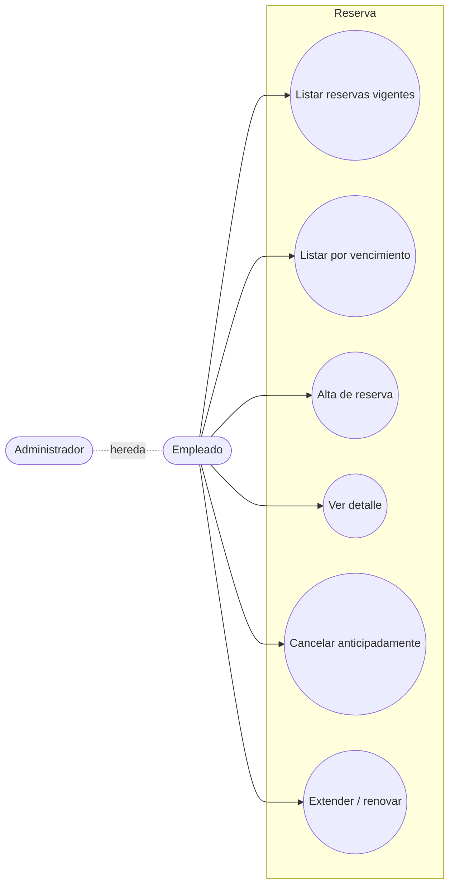
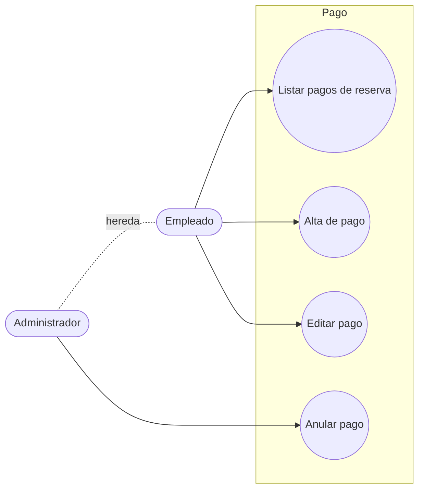

# Casos de Uso — Reservas y Pagos

> **Fuente de verdad:** [
arrativa.md](../narrativa.md)
> **Terminología canónica:** ver [contexto-proyecto.md](../contexto-proyecto.md)

---

## Reserva

| ID | Caso de uso | Actor | Notas | Ref. narrativa |
|----|-------------|-------|-------|----------------|
| CU-R01 | Listar reservas vigentes | Empleado, Admin | Por fecha desde/hasta | 11, I05 |
| CU-R02 | Listar reservas por vencimiento | Empleado, Admin | Plazo configurable (X días) | I06 |
| CU-R03 | Alta de reserva | Empleado, Admin | Requiere inmueble disponible en esas fechas; el inmueble tiene un % de seña definido — ⚠️ confirmar si se genera el pago de seña automáticamente al crear la reserva o se carga a mano | 11, 12 |
| CU-R04 | Ver detalle de reserva | Empleado, Admin | Auditoría (quién creó / terminó) visible solo para Admin | 23 |
| CU-R05 | Cancelar reserva anticipadamente | Empleado, Admin | Calcula multa, la registra como pago obligatorio antes de finalizar; conserva fecha original | 15, 16, 17, 18 |
| CU-R06 | Extender / renovar reserva | Empleado, Admin | Genera nueva reserva; no modifica la original | 19 |

---

## Pago

| ID | Caso de uso | Actor | Notas | Ref. narrativa |
|----|-------------|-------|-------|----------------|
| CU-PA01 | Listar pagos de una reserva | Empleado, Admin | Desde la misma pantalla se puede cargar un nuevo pago | 13, I07 |
| CU-PA02 | Alta de pago | Empleado, Admin | Concepto, fecha, importe | 13 |
| CU-PA03 | Editar pago | Empleado, Admin | Solo se puede editar el concepto | 14 |
| CU-PA04 | Anular pago | Admin | Cambio de estado (no borrado físico); ⚠️ confirmar con docente si aplica solo Admin | 14, 21 |

---

## Estado

- [x] Reservas y Pagos relevados
- [ ] Detalle de cada CU redactado
