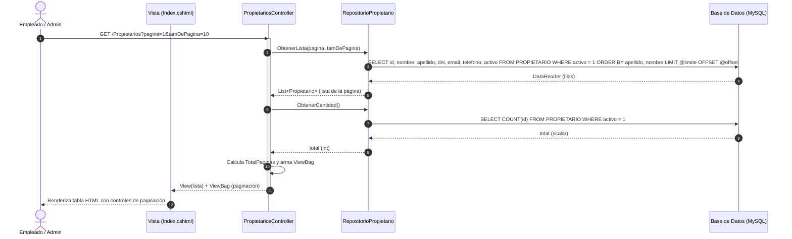

# CU-P01 — Listar Propietarios

> **Módulo:** Entidades Base  
> **Actor principal:** Empleado, Administrador  
> **Fuente de verdad:** [`../../narrativa.md`](../../narrativa.md) (Ítems 1, 2, 32, 33)  
> **Reglas de negocio y código:** [`PropietariosController.cs`](../../../Controllers/PropietariosController.cs) y [`RepositorioPropietario.cs`](../../../Repositories/RepositorioPropietario.cs)

---

## 1. Descripción
Permite visualizar la nómina de propietarios registrados y activos en el sistema mediante una tabla paginada resuelta en el servidor, ordenada alfabéticamente por apellido y nombre.

---

## 2. Precondiciones
- El usuario se encuentra autenticado con rol `Empleado` o `Administrador`.

---

## 3. Postcondiciones
- Se presenta la vista con la lista de propietarios correspondiente a la página solicitada y los controles de paginación calculados.

---

## 4. Reglas de Negocio Aplicadas
1. **RN-P01-1 (Paginación obligatoria en servidor):** Se resuelven el número de página y tamaño de página en el backend vía SQL (`LIMIT` y `OFFSET`), restringiendo el tamaño de página entre 1 y 50 registros.
2. **RN-P01-2 (Filtro de baja lógica):** Solo se listan registros con `activo = 1`.
3. **RN-P01-3 (Ordenamiento):** La lista se presenta ordenada por `apellido ASC, nombre ASC`.

---

## 5. Flujo Principal
1. El usuario navega a la sección "Propietarios" o selecciona un número de página específico.
2. El sistema recibe la petición con los parámetros `pagina` y `tamDePagina`.
3. El sistema consulta al repositorio la lista de registros de la página y el total general de propietarios activos.
4. El sistema calcula la cantidad total de páginas y asigna la información a la vista.
5. El sistema renderiza la tabla HTML con los datos obtenidos y el paginador interactivo.

---

## 6. Diagrama de Secuencia

