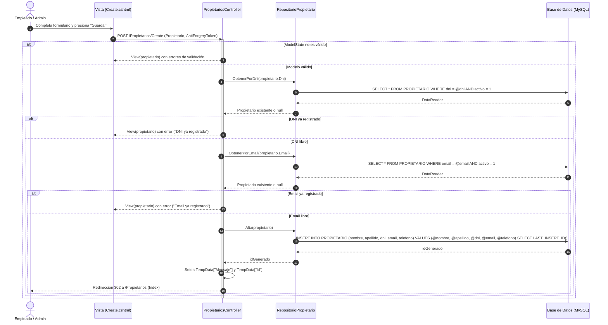

# CU-P02 — Alta de Propietario

> **Módulo:** Entidades Base  
> **Actor principal:** Empleado, Administrador  
> **Fuente de verdad:** [`../../narrativa.md`](../../narrativa.md) (Ítems 1, 2)  
> **Reglas de negocio y código:** [`PropietariosController.cs`](../../../Controllers/PropietariosController.cs) y [`RepositorioPropietario.cs`](../../../Repositories/RepositorioPropietario.cs)

---

## 1. Descripción
Permite registrar un nuevo propietario en el sistema ingresando sus datos personales y de contacto, asegurando la unicidad de DNI y correo electrónico.

---

## 2. Precondiciones
- El usuario se encuentra autenticado con rol `Empleado` o `Administrador`.

---

## 3. Postcondiciones
- Se inserta el nuevo registro en la tabla `PROPIETARIO` con `activo = 1`.
- Se recupera el identificador autogenerado (`LAST_INSERT_ID()`).
- Se notifica la creación exitosa mediante mensaje temporal (`TempData`) y se redirige al listado principal.

---

## 4. Reglas de Negocio Aplicadas
1. **RN-P02-1 (Unicidad de DNI):** No puede registrarse un propietario cuyo DNI ya pertenezca a otro propietario activo en la base de datos.
2. **RN-P02-2 (Unicidad de Email):** No puede registrarse un correo electrónico ya utilizado por otro propietario activo.
3. **RN-P02-3 (Validación de Modelo):** Todos los campos requeridos (Nombre, Apellido, DNI, Email, Teléfono) deben cumplir las anotaciones de validación de formato y longitud.

---

## 5. Flujo Principal
1. El usuario navega al formulario de alta (`GET /Propietarios/Create`).
2. El usuario completa los datos del propietario y presiona "Guardar".
3. El sistema valida las restricciones del modelo (`ModelState.IsValid`).
4. El sistema consulta si ya existe un propietario activo con el mismo DNI.
5. El sistema consulta si ya existe un propietario activo con el mismo Email.
6. Al superar las validaciones, el sistema ejecuta la inserción en la base de datos y obtiene el nuevo ID generado.
7. El sistema almacena el mensaje de confirmación en `TempData` y redirige al listado (`GET /Propietarios`).

---

## 6. Flujos Alternativos y Excepciones
- **FA1 — Modelo inválido:** Si faltan campos requeridos o el formato es incorrecto, se vuelve a presentar el formulario con los mensajes de error.
- **FA2 — DNI duplicado:** Se añade un error a `ModelState` indicando "Ya existe un propietario registrado con este DNI" y se devuelve la vista.
- **FA3 — Email duplicado:** Se añade un error a `ModelState` indicando "Ya existe un propietario registrado con este correo electrónico" y se devuelve la vista.

---

## 7. Diagrama de Secuencia

