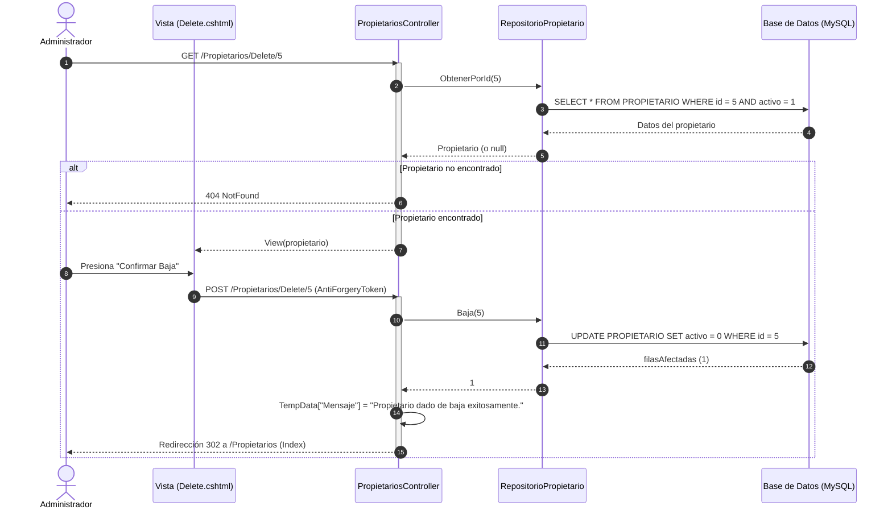

# CU-P04 — Eliminar Propietario

> **Módulo:** Entidades Base  
> **Actor principal:** Administrador  
> **Fuente de verdad:** [`../../narrativa.md`](../../narrativa.md) (Ítem 21)  
> **Reglas de negocio y código:** ver [`../../../AGENTS.md`](../../../AGENTS.md), [`PropietariosController.cs`](../../../Controllers/PropietariosController.cs) y [`RepositorioPropietario.cs`](../../../Repositories/RepositorioPropietario.cs)

---

## 1. Descripción
Permite a un usuario administrador dar de baja a un propietario. Por regla universal de la arquitectura, se realiza una **baja lógica** (`activo = 0`), manteniendo la integridad referencial e histórica de los inmuebles y reservas asociados.

---

## 2. Precondiciones
- El usuario autenticado posee rol `Administrador`.
- El propietario a eliminar existe y se encuentra activo en el sistema.

---

## 3. Postcondiciones
- El registro del propietario pasa a tener `activo = 0`.
- El propietario deja de figurar en los listados y búsquedas convencionales.

---

## 4. Reglas de Negocio Aplicadas
1. **RN-P04-1 (Baja lógica universal):** No se ejecutan sentencias `DELETE` sobre la tabla `PROPIETARIO`. La eliminación se implementa mediante `UPDATE PROPIETARIO SET activo = 0 WHERE id = @id`.
2. **RN-P04-2 (Restricción por rol):** La eliminación de registros está reservada exclusivamente a usuarios con rol `Administrador`.
3. **RN-P04-3 (Protección por dependencias):** Si ocurriera una excepción de integridad o restricción de clave foránea, se captura y se informa mediante mensaje de error sin interrumpir el flujo del sistema.

---

## 5. Flujo Principal
1. El administrador accede a la pantalla de confirmación de eliminación (`GET /Propietarios/Delete/{id}`).
2. El sistema recupera y muestra los datos del propietario.
3. El administrador presiona "Confirmar Baja".
4. El sistema ejecuta la baja lógica a través del repositorio (`POST /Propietarios/Delete/{id}`).
5. El sistema registra el mensaje de éxito en `TempData` y redirige al listado principal.

---

## 6. Flujos Alternativos y Excepciones
- **FA1 — Propietario inexistente o ya inactivo:** Si el `id` no existe en la base de datos, el sistema retorna respuesta `404 NotFound`.
- **FA2 — Error de integridad referencial:** Si ocurre una excepción en la base de datos, se almacena el aviso en `TempData["Error"]` y se redirige al listado.

---

## 7. Diagrama de Secuencia

