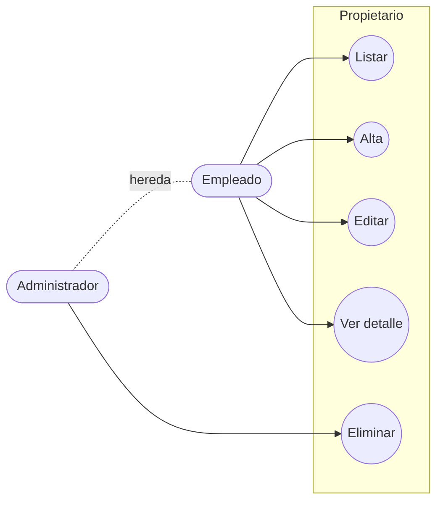
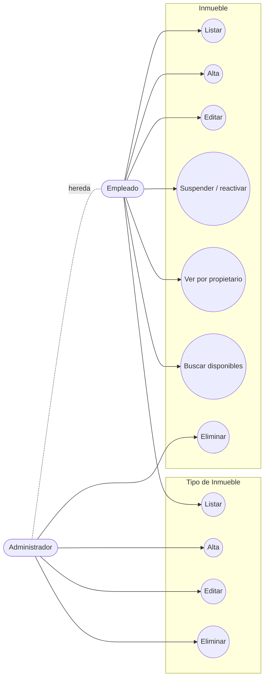
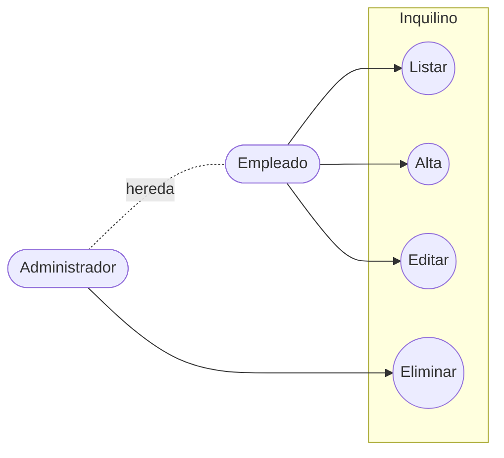
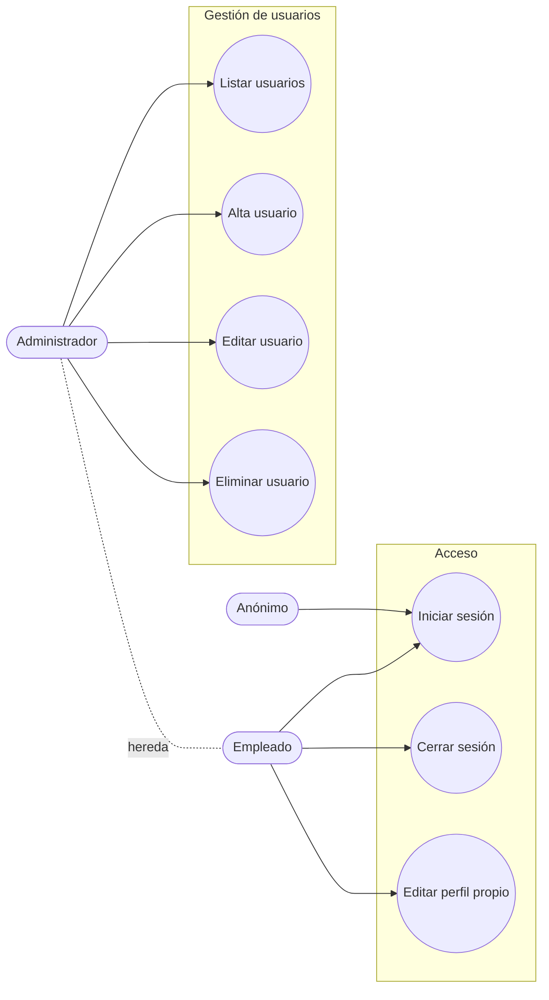

# Casos de Uso — Entidades Base

> **Fuente de verdad:** [`../../narrativa.md`](../../narrativa.md)  
> **Terminología canónica:** ver [`../../AGENTS.md`](../../AGENTS.md)

---

## Propietario

| ID | Caso de uso | Actor | Detalle / Diagrama | Ref. narrativa |
|----|-------------|-------|--------------------|----------------|
| **[CU-P01](./CU-P01-listar-propietarios.md)** | **Listar propietarios** | Empleado, Admin | 📄 [Ver detalle y secuencia](./CU-P01-listar-propietarios.md) | 1, 2, 32, 33 |
| **[CU-P02](./CU-P02-alta-propietario.md)** | **Alta de propietario** | Empleado, Admin | 📄 [Ver detalle y secuencia](./CU-P02-alta-propietario.md) | 1, 2 |
| CU-P03 | Edición de propietario | Empleado, Admin | — | 1, 2 |
| **[CU-P04](./CU-P04-eliminar-propietario.md)** | **Eliminar propietario** | Admin | 📄 [Ver detalle y secuencia](./CU-P04-eliminar-propietario.md) | 21 |
| CU-P05 | Ver detalle de propietario | Empleado, Admin | Incluye sus inmuebles asociados | 2 |

---

## Inmueble

| ID | Caso de uso | Actor | Notas | Ref. narrativa |
|----|-------------|-------|-------|----------------|
| CU-I01 | Listar inmuebles | Empleado, Admin | Filtro por estado (disponible/suspendido) | 8, 24 |
| CU-I02 | Alta de inmueble | Empleado, Admin | Requiere propietario; imagen portada y galería | 6 |
| CU-I03 | Edición de inmueble | Empleado, Admin | | 6 |
| CU-I04 | Eliminar inmueble | Admin | Baja lógica (`activo = 0`) | 21 |
| CU-I05 | Suspender / reactivar inmueble | Empleado, Admin | No afecta reservas vigentes | 8 |
| CU-I06 | Ver inmuebles de un propietario | Empleado, Admin | Sublistado en detalle de propietario | 2, 25 |
| CU-I07 | Buscar inmuebles disponibles por fechas | Empleado, Admin | Base para crear reserva | 10, 31 |

### Tipo de Inmueble

| ID | Caso de uso | Actor | Notas | Ref. narrativa |
|----|-------------|-------|-------|----------------|
| CU-TI01 | Listar tipos de inmueble | Empleado, Admin | | 7 |
| CU-TI02 | Alta de tipo | Admin | | 7 |
| CU-TI03 | Edición de tipo | Admin | | 7 |
| CU-TI04 | Eliminar tipo | Admin | Validar que no existan inmuebles asociados | 7, 21 |

---

## Inquilino

| ID | Caso de uso | Actor | Notas | Ref. narrativa |
|----|-------------|-------|-------|----------------|
| CU-IN01 | Listar inquilinos | Empleado, Admin | Paginado por servidor | 9 |
| CU-IN02 | Alta de inquilino | Empleado, Admin | DNI, nombre, datos de contacto | 9 |
| CU-IN03 | Edición de inquilino | Empleado, Admin | | 9 |
| CU-IN04 | Eliminar inquilino | Admin | Baja lógica (`activo = 0`) | 9, 21 |

---

## Usuario

| ID | Caso de uso | Actor | Notas | Ref. narrativa |
|----|-------------|-------|-------|----------------|
| CU-U01 | Iniciar sesión | Anónimo | Email + contraseña | 20 |
| CU-U02 | Cerrar sesión | Empleado, Admin | | 20 |
| CU-U03 | Editar perfil propio | Empleado, Admin | Datos personales, contraseña, avatar | 22 |
| CU-U04 | Listar usuarios | Admin | Solo administradores | 21 |
| CU-U05 | Alta de usuario | Admin | Asignar rol (Empleado / Admin) | 21 |
| CU-U06 | Editar usuario | Admin | Incluye cambio de rol y estado | 21 |
| CU-U07 | Eliminar usuario | Admin | Baja lógica (`activo = 0`) | 21 |

---

## Estado

- [x] Entidades relevadas
- [x] Bajas lógicas formalizadas
- [x] Diagramas de secuencia y especificación para Propietarios (CU-P01, CU-P02, CU-P04)
