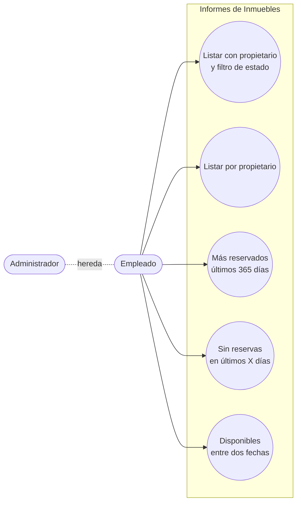
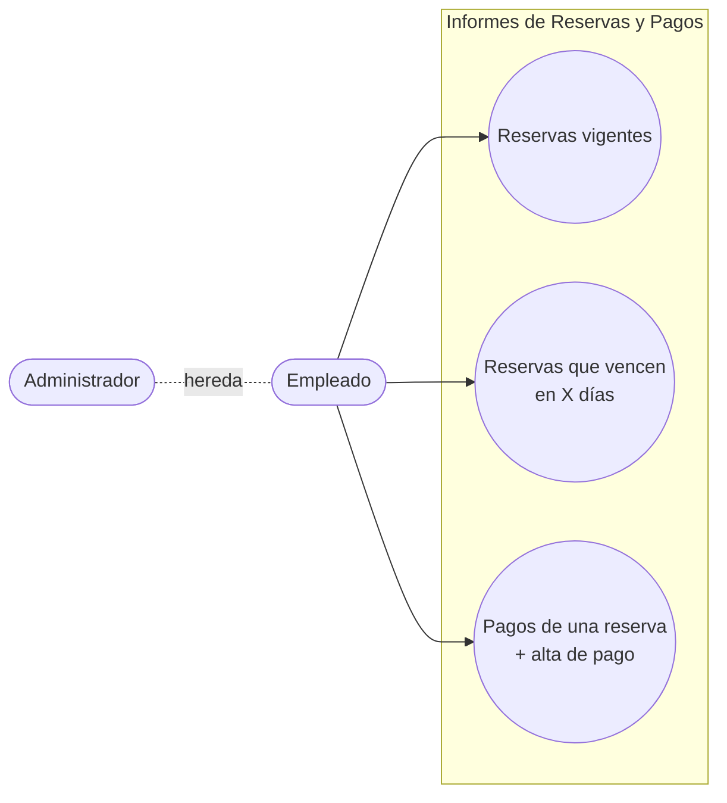

# Casos de Uso — Informes

> **Fuente de verdad:** [`../../narrativa.md`](../../narrativa.md)  
> **Terminología canónica:** ver [`../../AGENTS.md`](../../AGENTS.md)

---

> **Nota:** varios informes del enunciado ya fueron capturados como CUs operacionales en otros módulos.  
> Se los lista aquí igualmente para trazabilidad completa.

---

## Informes de Inmuebles

| ID | Caso de uso | Actor | Notas | Ref. narrativa |
|----|-------------|-------|-------|----------------|
| CU-INF01 | Listar inmuebles con propietario, filtrar por disponibilidad | Empleado, Admin | Cubre el listado principal de inmuebles — ver CU-I01 | 24 |
| CU-INF02 | Listar inmuebles de un propietario específico | Empleado, Admin | Sublistado en detalle de propietario — ver CU-I06 | 25 |
| CU-INF03 | Inmuebles más reservados en los últimos 365 días | Empleado, Admin | Requiere consulta agregada; nuevo CU sin equivalente operacional | 26 |
| CU-INF04 | Inmuebles sin reservas en los últimos X días | Empleado, Admin | X configurable (30, 60, etc.); nuevo CU sin equivalente operacional | 27 |
| CU-INF05 | Listar inmuebles disponibles entre dos fechas | Empleado, Admin | Base para crear reserva — ver CU-I07 | 31 |

---

## Informes de Reservas y Pagos

| ID | Caso de uso | Actor | Notas | Ref. narrativa |
|----|-------------|-------|-------|----------------|
| CU-INF06 | Listar reservas vigentes | Empleado, Admin | Ver CU-R01 | 28 |
| CU-INF07 | Listar reservas que vencen en X días | Empleado, Admin | Plazo configurable — ver CU-R02 | 29 |
| CU-INF08 | Listar pagos de una reserva + cargar nuevo pago | Empleado, Admin | La pantalla de listado permite alta directa — ver CU-PA01, CU-PA02 | 30 |

---

## Estado

- [x] Informes relevados
