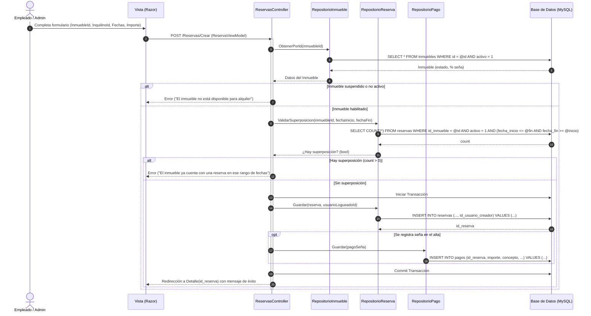

# CU-R03 — Alta de Reserva

> **Módulo:** Reservas y Pagos  
> **Actor principal:** Empleado, Administrador  
> **Fuente de verdad:** [`../../narrativa.md`](../../narrativa.md) (Ítems 10, 11, 12)  
> **Reglas de negocio:** ver [`../../AGENTS.md`](../../AGENTS.md)

---

## 1. Descripción
Permite registrar una nueva reserva sobre un inmueble específico para un inquilino determinado en un rango de fechas (`fecha_inicio` a `fecha_fin`), validando la no superposición de períodos y calculando el importe total y la seña correspondiente según la configuración del inmueble.

---

## 2. Precondiciones
- El usuario autenticado posee rol `Empleado` o `Administrador`.
- El inmueble existe, está activo (`activo = 1`) y no se encuentra suspendido.
- El inquilino existe y está activo (`activo = 1`).
- Las fechas solicitadas cumplen `fecha_inicio < fecha_fin` y son iguales o posteriores a la fecha actual.

---

## 3. Postcondiciones
- Se persiste el registro de la `Reserva` con estado activo, vinculada al inmueble, inquilino y con auditoría del usuario creador (`id_usuario_creador`).
- Si se ingresa el cobro de la seña en el mismo acto, se registra el correspondiente `Pago` con concepto "Seña de reserva".

---

## 4. Reglas de Negocio Aplicadas
1. **RN-R01 (No superposición):** No pueden coexistir reservas activas para el mismo inmueble cuyos rangos de fechas se solapen:
   $$\neg (\text{fecha\_fin} < \text{nueva\_inicio} \lor \text{fecha\_inicio} > \text{nueva\_fin})$$
2. **RN-R02 (Cálculo de Seña):** El importe de la seña surge del porcentaje definido en la entidad `Inmueble` sobre el monto total pactado o base.
3. **RN-R03 (Auditoría obligatoria):** Toda reserva registra el identificador del usuario que realizó la creación.

---

## 5. Flujo Principal
1. El usuario accede al formulario de alta de reserva (o proviene desde la búsqueda de inmuebles disponibles por fechas).
2. El usuario selecciona el inmueble, inquilino, fecha desde y fecha hasta.
3. El sistema valida en el servidor que no existan reservas solapadas para el inmueble en dicho rango.
4. El sistema calcula y muestra el importe total y el porcentaje/monto sugerido de la seña.
5. El usuario confirma el registro ingresando los datos del pago inicial (seña) si corresponde.
6. El sistema guarda la reserva y el pago asociado dentro de una transacción en base de datos.
7. El sistema redirige a la vista de detalle de la reserva con mensaje de confirmación.

---

## 6. Flujos Alternativos y Excepciones
- **FA1 — Inmueble no disponible (superposición):** El sistema detecta una reserva activa en ese rango, cancela el alta y notifica al usuario indicando el conflicto de fechas.
- **FA2 — Inmueble suspendido o dado de baja:** El sistema rechaza la operación informando que el inmueble no está habilitado para recibir ofertas o reservas.
- **FA3 — Fechas inválidas:** Si `fecha_inicio >= fecha_fin` o son fechas pasadas, el sistema devuelve error de validación de modelo.

---

## 7. Diagrama de Secuencia

