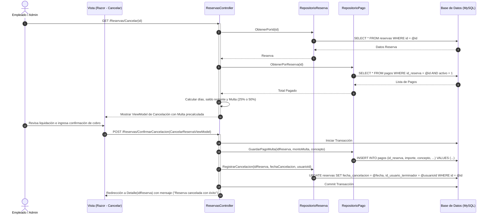

# CU-R05 — Cancelar Reserva Anticipadamente

> **Módulo:** Reservas y Pagos  
> **Actor principal:** Empleado, Administrador  
> **Fuente de verdad:** [`../../narrativa.md`](../../narrativa.md) (Ítems 15, 16, 17, 18)  
> **Reglas de negocio:** ver [`../../AGENTS.md`](../../AGENTS.md)

---

## 1. Descripción
Permite registrar la rescisión o cancelación anticipada de una reserva vigente antes de su fecha de vencimiento original. El sistema liquida la multa obligatoria según el porcentaje de tiempo transcurrido sobre el contrato y exige el registro del pago de dicha multa en la misma pantalla para efectivizar la finalización.

---

## 2. Precondiciones
- El usuario autenticado posee rol `Empleado` o `Administrador`.
- La reserva se encuentra activa y vigente (`fecha_actual < fecha_fin_original`).
- La reserva no fue cancelada previamente.

---

## 3. Postcondiciones
- Se registra un nuevo `Pago` con concepto "Multa por cancelación anticipada" por el importe exacto calculado.
- Se actualiza la `Reserva` con la fecha de rescisión real y el identificador del usuario que efectuó la baja (`id_usuario_terminador`).
- Se conserva inalterada la `fecha_fin` original de la reserva para fines históricos y de auditoría.

---

## 4. Reglas de Negocio Aplicadas

### Cálculo de la Multa
1. **Tiempo transcurrido:**  
   $$\text{días\_totales} = \text{fecha\_fin} - \text{fecha\_inicio}$$  
   $$\text{días\_transcurridos} = \text{fecha\_cancelación} - \text{fecha\_inicio}$$  
   $$\text{porcentaje\_tiempo} = \frac{\text{días\_transcurridos}}{\text{días\_totales}}$$

2. **Saldo restante del contrato:**  
   $$\text{saldo\_restante} = \text{importe\_total} - \text{total\_pagos\_realizados}$$

3. **Determinación del porcentaje de penalización:**
   - Si $\text{porcentaje\_tiempo} < 0.50$ (menos del 50% del plazo):  
     $$\text{multa} = \text{saldo\_restante} \times 0.50 \quad (50\% \text{ del saldo restante})$$
   - Si $\text{porcentaje\_tiempo} \ge 0.50$ (50% o más del plazo):  
     $$\text{multa} = \text{saldo\_restante} \times 0.25 \quad (25\% \text{ del saldo restante})$$

4. **Pago obligatorio en el acto:** La reserva no puede pasar a estado cancelado sin que la transacción registre con éxito el cobro de la multa calculada.

5. **Auditoría:** Se registra `id_usuario_terminador` y `fecha_cancelacion`.

---

## 5. Flujo Principal
1. El usuario solicita cancelar una reserva desde la pantalla de detalle de reserva.
2. El sistema recupera la reserva y los pagos registrados hasta la fecha.
3. El sistema calcula la cantidad de días transcurridos, el saldo restante y la multa correspondiente.
4. El sistema presenta la vista de confirmación y liquidación con el detalle del cálculo y los campos para registrar el pago de la multa (medio de pago, concepto predeterminado, fecha actual).
5. El usuario confirma la cancelación y el cobro de la multa.
6. El sistema inicia una transacción en base de datos:
   a. Inserta el pago correspondiente a la multa.
   b. Actualiza la reserva con fecha de cancelación efectiva y el ID del usuario terminador.
   c. Confirma la transacción (Commit).
7. El sistema redirige al detalle de la reserva mostrando el estado actualizado y el nuevo pago registrado.

---

## 6. Flujos Alternativos y Excepciones
- **FA1 — Reserva con saldo restante cero o negativo:** Si el saldo restante es $\le 0$, la multa calculada es $\$0$, procediendo a registrar la finalización con constancia de liquidación en $\$0$.
- **FA2 — Falla en el registro del pago de la multa:** Si la inserción del pago falla, se aborta la transacción (Rollback) y la reserva permanece vigente sin modificaciones.

---

## 7. Diagrama de Secuencia

