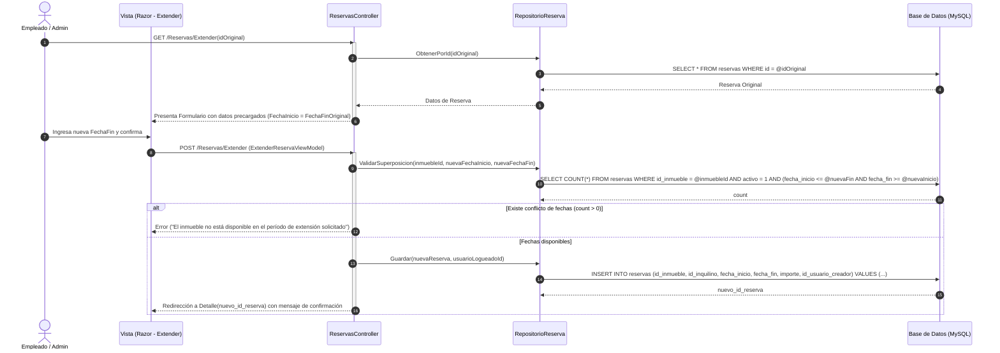

# CU-R06 — Extender / Renovar Reserva

> **Módulo:** Reservas y Pagos  
> **Actor principal:** Empleado, Administrador  
> **Fuente de verdad:** [`../../narrativa.md`](../../narrativa.md) (Ítem 19)  
> **Reglas de negocio:** ver [`../../AGENTS.md`](../../AGENTS.md)

---

## 1. Descripción
Permite prolongar el período de ocupación de un inquilino sobre un inmueble. Por regla de arquitectura del dominio, esta operación **no modifica la reserva existente**, sino que genera una **nueva reserva** vinculada al mismo inquilino e inmueble, iniciando inmediatamente tras la finalización de la original.

---

## 2. Precondiciones
- El usuario autenticado posee rol `Empleado` o `Administrador`.
- La reserva original existe y está activa (`activo = 1`).
- El inmueble no tiene otras reservas superpuestas durante el período de extensión solicitado (`fecha_fin_original` hasta `nueva_fecha_fin`).

---

## 3. Postcondiciones
- Se crea una **nueva entidad Reserva** en el sistema con su propio ciclo de vida, importes y auditoría del usuario creador.
- La reserva original permanece intacta en sus fechas, importes y pagos históricos.

---

## 4. Reglas de Negocio Aplicadas
1. **RN-R06-1 (Inmutabilidad del contrato original):** La reserva original NO sufre modificaciones en su `fecha_fin` ni en sus registros contables.
2. **RN-R06-2 (Continuidad de fechas):** La `fecha_inicio` de la nueva reserva debe coincidir con la fecha de fin de la reserva previa (o el día posterior, según convención del negocio).
3. **RN-R06-3 (No superposición):** Se debe validar que no existan reservas posteriores ya confirmadas en el nuevo rango de fechas.
4. **RN-R06-4 (Auditoría):** La nueva reserva registra `id_usuario_creador` del operador actual.

---

## 5. Flujo Principal
1. El usuario selecciona la opción "Extender / Renovar" desde la vista de detalle de una reserva existente.
2. El sistema precarga los datos del formulario de alta:
   - Inmueble e Inquilino vinculados (solo lectura).
   - `FechaInicio` establecida en la `FechaFin` de la reserva anterior.
3. El usuario ingresa la nueva `FechaFin` y el nuevo monto pactado para la extensión.
4. El sistema valida la disponibilidad del inmueble en el nuevo rango solicitado.
5. El usuario confirma la creación de la nueva reserva.
6. El sistema persiste la nueva reserva y opcionalmente asocia una referencia a la reserva precedente si correspondiera.
7. El sistema redirige al detalle de la nueva reserva.

---

## 6. Flujos Alternativos y Excepciones
- **FA1 — Superposición con otra reserva futura:** Si existe otra reserva ya registrada para ese inmueble dentro del período de extensión, el sistema rechaza la operación e informa las fechas en conflicto.

---

## 7. Diagrama de Secuencia

