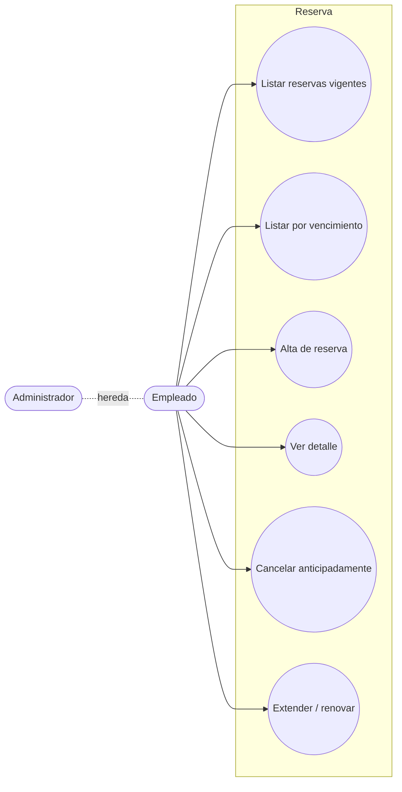
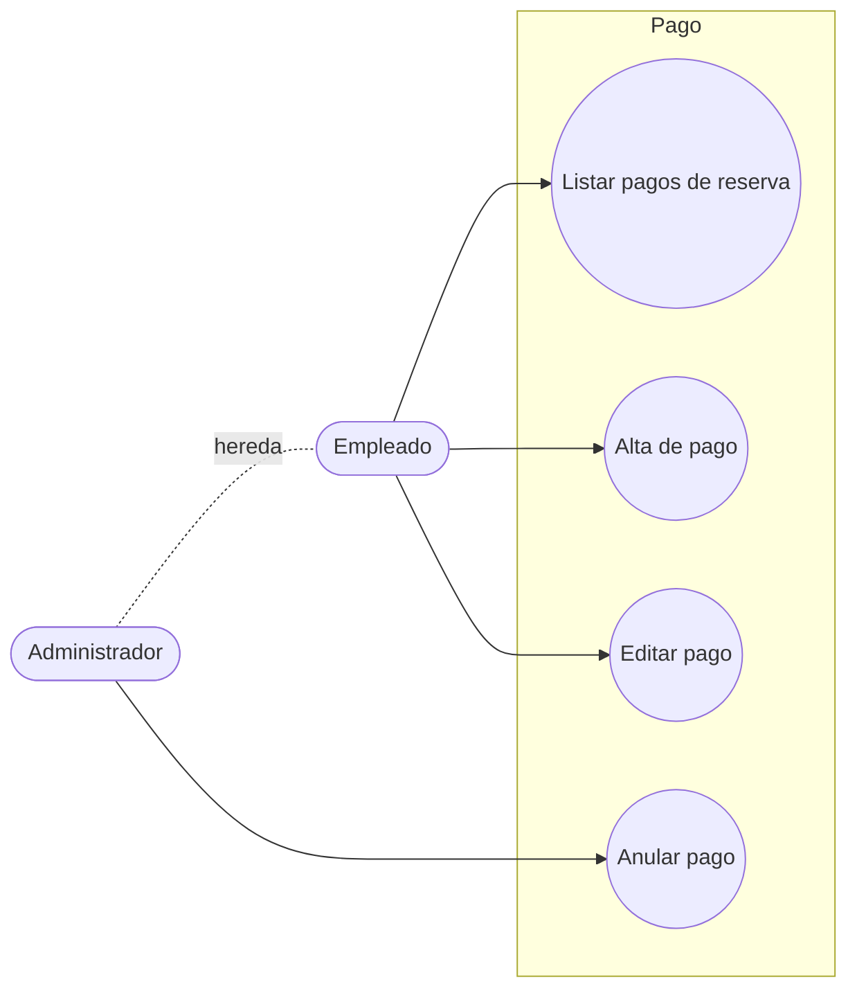

# Casos de Uso — Reservas y Pagos

> **Fuente de verdad:** [`../../narrativa.md`](../../narrativa.md)  
> **Terminología canónica:** ver [`../../AGENTS.md`](../../AGENTS.md)

---

## Reserva

| ID | Caso de uso | Actor | Notas / Detalle | Ref. narrativa |
|----|-------------|-------|-----------------|----------------|
| CU-R01 | Listar reservas vigentes | Empleado, Admin | Por fecha desde/hasta | 11, I05 |
| CU-R02 | Listar reservas por vencimiento | Empleado, Admin | Plazo configurable (X días) | I06 |
| **[CU-R03](./CU-R03-alta-reserva.md)** | **Alta de reserva** | Empleado, Admin | 📄 [Ver detalle y diagrama de secuencia](./CU-R03-alta-reserva.md) | 11, 12 |
| CU-R04 | Ver detalle de reserva | Empleado, Admin | Auditoría visible solo para Admin | 23 |
| **[CU-R05](./CU-R05-cancelar-reserva.md)** | **Cancelar reserva anticipadamente** | Empleado, Admin | 📄 [Ver detalle y diagrama de secuencia](./CU-R05-cancelar-reserva.md) | 15, 16, 17, 18 |
| **[CU-R06](./CU-R06-extender-reserva.md)** | **Extender / renovar reserva** | Empleado, Admin | 📄 [Ver detalle y diagrama de secuencia](./CU-R06-extender-reserva.md) | 19 |

---

## Pago

| ID | Caso de uso | Actor | Notas | Ref. narrativa |
|----|-------------|-------|-------|----------------|
| CU-PA01 | Listar pagos de una reserva | Empleado, Admin | Desde la misma pantalla se puede cargar un nuevo pago | 13, I07 |
| CU-PA02 | Alta de pago | Empleado, Admin | Concepto, fecha, importe | 13 |
| CU-PA03 | Editar pago | Empleado, Admin | Solo se puede editar el concepto | 14 |
| CU-PA04 | Anular pago | Admin | Cambio de estado / baja lógica (`activo = 0`) | 14, 21 |

---

## Estado

- [x] Reservas y Pagos relevados
- [x] Detalle y diagramas de secuencia de CU críticos redactados (CU-R03, CU-R05, CU-R06)
