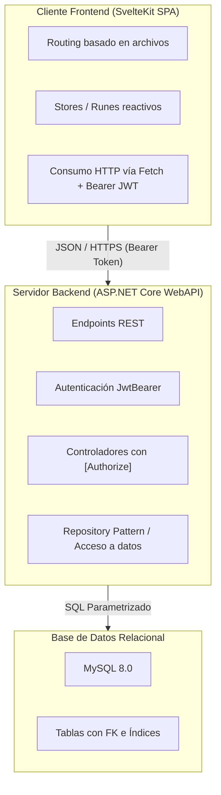

# Especificación Consolidada: Proyecto Propio Final

Documento base que unifica la consigna oficial de la cátedra con las aclaraciones, decisiones arquitectónicas y criterios acordados para la promoción.

---

## 1. Resumen Ejecutivo

| Parámetro | Definición |
|---|---|
| **Modalidad** | Individual (Emanuel Angel) |
| **Backend** | ASP.NET Core WebAPI (.NET 10) |
| **Frontend** | SPA desacoplada en SvelteKit (modo cliente / `adapter-static`) |
| **Autenticación** | JWT (JSON Web Tokens) como mecanismo único (WebAPI + SPA) |
| **Dominio** | Ficticio/modelado permitido (no requiere cliente real), con ~3-4 entidades de negocio |
| **Evaluación** | Ejecución en `localhost` (sin deploy cloud) + defensa técnica oral (~20 min) |
| **Fecha tentativa** | 06/11/2026 |

---

## 2. Requerimientos Mínimos de la Cátedra y Decisiones Acordadas

| Requerimiento Cátedra | Detalle de la Consigna | Decisión / Criterio Acordado |
|---|---|---|
| **Tablas / Clases** | Mínimo 4 clases/tablas con al menos una relación 1 a N. | Aunque `Usuario` y `Rol` cuentan, se diseñarán **3 a 4 tablas de negocio** (+2 de auth) para una arquitectura profesional y creíble. |
| **Seguridad y Roles** | Login con roles, uso de `[Authorize]`, funciones restringidas por rol y avatar de usuario. | Auth basada en JWT. Endpoints protegidos por roles (`Admin`, `Operador`). Subida y servicio de avatar con validación. |
| **Manejo de Archivos** | Uso de archivos adicional al avatar. | La entidad principal de negocio incluirá adjuntos (ej. comprobantes, PDFs de informe, o imágenes de estado). |
| **Frontend / AJAX** | Al menos un CRUD con framework frontend y toda la funcionalidad vía AJAX. | **100% SPA desacoplada**: toda la aplicación consumirá la WebAPI vía peticiones HTTP asíncronas con SvelteKit. |
| **Paginación** | Servir cada página por petición desde el servidor (no traer todo y paginar en cliente). | Paginación server-side con metadata (`pageNumber`, `pageSize`, `totalRecords`, `totalPages`). |
| **Búsqueda Relacionada** | Selección de entidades vinculadas mediante búsqueda asíncrona (AJAX), sin listar todo. | Componente de búsqueda predictiva / autocompletado en cliente que consulta endpoint con filtro y paginado. |
| **Uso de API con JWT** | Consumo natural o colección para probar vía Postman/Thunder Client. | La SPA es el consumidor natural de la API; se proveerá además la colección exportada para evaluación independiente. |

---

## 3. Arquitectura del Sistema

---

## 4. Checklist de Entregables (Criterios de Promoción)

Para acceder a la promoción directa, el repositorio debe contener:

- [ ] `.gitignore` específico y limpio (sin artefactos de compilación `bin/`, `obj/`, `.svelte-kit/`, `node_modules/`).
- [ ] Diagrama de Entidad-Relación (DER) o diagrama de clases.
- [ ] `README.md` completo con descripción del proyecto y guía paso a paso para levantar backend, frontend y BD.
- [ ] Sección en `README.md` o archivo de mapeo detallando la ubicación exacta en el código de cada requerimiento mínimo.
- [ ] Script SQL de inicialización con estructura y datos semilla listos para probar (`database.sql`).
- [ ] Credenciales de usuarios de prueba preconfigurados para cada rol del sistema.
- [ ] Colección exportada de Postman / Thunder Client para auditar todos los endpoints con JWT.
