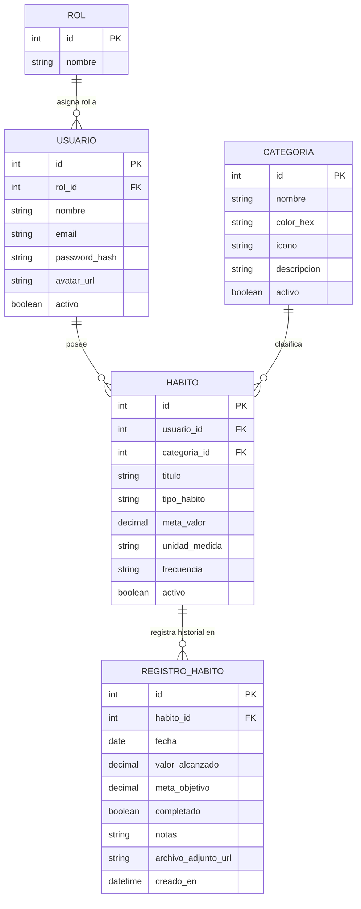
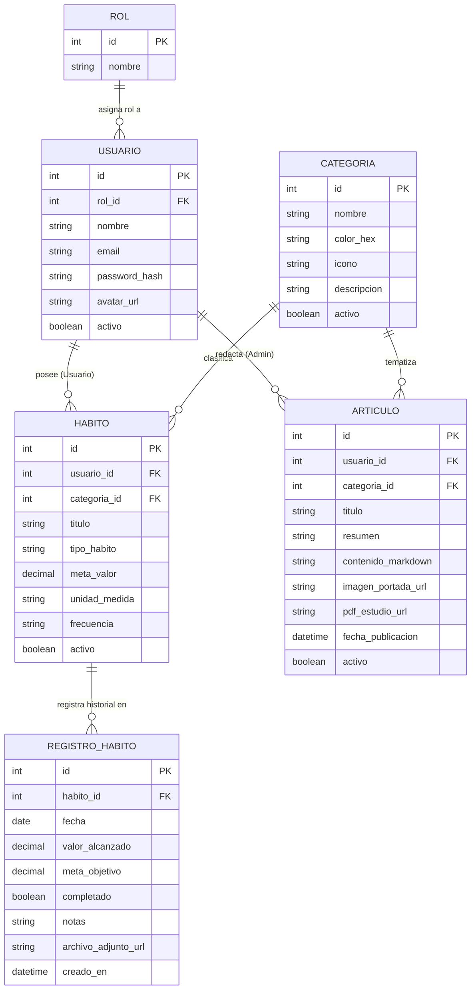

# Propuesta: Habit & Consistency Tracker (Hub de Hábitos)

Propuesta de proyecto final orientada a la promoción de la asignatura, estructurada sobre una arquitectura desacoplada y lista para ser validada con la cátedra.

---

## 1. Ficha Técnica

| Parámetro | Detalle |
|---|---|
| **Nombre tentativo** | HabitHub / Consistency Tracker |
| **Tipo de Sistema** | Plataforma web de seguimiento de hábitos, cadencia y consistencia personal |
| **Backend** | ASP.NET Core WebAPI (.NET 10) |
| **Frontend** | SvelteKit SPA (modo cliente con `@sveltejs/adapter-static`) |
| **Base de Datos** | MySQL 8.0 (acceso relacional con Repository Pattern) |
| **Autenticación** | JWT (JSON Web Tokens) con roles (`Administrador`, `Usuario`) |
| **Alcance temporal** | MVP ejecutable en `localhost` para la defensa técnica (06/11/2026) |

---

## 2. Problemática y Justificación

### El Problema
Las herramientas actuales de productividad fallan en los extremos:
- **Gestores to-do genéricos (Google Tasks, Todoist):** tratan a los hábitos como tareas descartables; no comprenden cadencia, frecuencia ni rachas acumulativas.
- **Documentación libre (Notion, Obsidian):** introducen demasiada fricción operativa y pasos para registrar un hábito cotidiano de 2 segundos.
- **Apps comerciales dedicadas:** en su mayoría imponen modelos de suscripción abusivos ($40-60 USD/anuales), bloatware, o esquemas de gamificación infantil que distraen del foco.

### La Solución
Un sistema centralizado, minimalista y libre de fricción enfocado en la **consistencia**:
- Hábitos configurables tanto cuantitativos (ej. tomar 8 vasos de agua, leer 20 páginas) como cualitativos/booleanos (ej. meditar, entrenar).
- Hábitos de reducción o abstinencia (*quit habits*, contador de días limpios).
- Visualización de alto impacto visual mediante un **heatmap de consistencia** (estilo gráfico de contribuciones de GitHub) e informes periódicos (semanales y mensuales).
- Registro de reflexiones o evidencias adjuntas (archivos PDF de rutinas, imágenes de progreso).

---

## 3. Alcance y Límites del MVP

### Dentro del Alcance (MVP para Promoción)
- Registro y autenticación de usuarios con gestión de avatar e inicio de sesión por JWT.
- ABM completo de Categorías / Áreas de vida (ej. Salud, Estudio, Trabajo, Bienestar).
- ABM completo de Hábitos vinculados a categorías, con configuración de meta, unidad y periodicidad.
- Registro diario (*Check-in*) con actualización de valores alcanzados, notas breves y subida de archivos adjuntos (comprobante, resumen o imagen de avance).
- Dashboard interactivo con listado diario interactivo y vista de heatmap de consistencia histórica.
- Búsqueda asíncrona (AJAX) para asociar hábitos a categorías o filtrar registros.
- Paginación server-side en el historial de registros de auditoría y reportes.

### Fuera de Alcance (Deliberadamente no contemplado)
- Integración de widgets nativos de sistema operativo.
- Planificador horario o calendario de agenda tipo Google Calendar.
- Temporizadores pomodoro integrados (se delega en herramientas dedicadas de escritorio como Pomody).
- Notificaciones push móviles nativas (quedan reservadas para la etapa móvil).

---

## 4. Modelo de Datos y Entidades

El modelo consta de **5 tablas estructuradas** (2 de autenticación y 3 de dominio puro), garantizando solidez conceptual sin sobrecarga:

### Descripción de Entidades:
1. **`Rol` & `Usuario`:** Autenticación, roles (`Admin` y `Usuario`), avatar de perfil en almacenamiento del servidor.
2. **`Categoria`:** Agrupador de hábitos (Salud, Estudio, etc.) con atributos visuales (color, icono).
3. **`Habito`:** Define la regla (tipo: booleano, cuantitativo o abstinencia; valor meta y frecuencia).
4. **`RegistroHabito` / `CheckIn`:** Instancia de ejecución de un hábito en una fecha determinada, con valor obtenido, completitud, notas y **archivo de respaldo adjunto** (evidencia, PDF de rutina, foto de progreso).

---

## 5. Mapeo contra Requerimientos Mínimos de la Cátedra

| Requerimiento Cátedra | Cómo se resuelve en este proyecto |
|---|---|
| **Al menos 4 tablas relacionadas (1 a N)** | Se implementan 5 tablas: `Rol -> Usuario`, `Categoria -> Habito`, `Habito -> RegistroHabito`. |
| **Seguridad con login, roles, `Authorize` y avatar** | Autenticación con JWT Bearer. Rol `Admin` administra categorías del sistema y audita métricas; rol `Usuario` gestiona sus hábitos. Avatar subido con validación de tipo y tamaño. |
| **Manejo de archivos adicional al avatar** | En `RegistroHabito`, los usuarios pueden adjuntar un archivo de evidencia o documentación por entrada (PDF de plan, imagen de comprobación, etc.). |
| **Al menos un CRUD en framework frontend vía AJAX** | Toda la SPA está construida en SvelteKit; todos los CRUDs (Categorías, Hábitos, Check-ins) se gestionan por peticiones HTTP asíncronas vía `fetch` a la WebAPI. |
| **Listados con paginado en servidor** | El historial completo de check-ins y auditorías de actividad se sirve mediante endpoints paginados en backend (`pageNumber`, `pageSize`, `totalRecords`). |
| **Búsqueda vía AJAX de entidades relacionadas** | Al crear o registrar hábitos, la selección de categorías o de hábitos existentes utiliza un componente de autocompletado que consulta a la API con `search` y `limit`. |
| **Uso de API con JWT** | La SPA consume la API mediante cabeceras `Authorization: Bearer <token>`. Se incluye la colección de Postman/Thunder Client con endpoints autenticados y variables de entorno. |

---

## 6. Módulos y Pantallas del Frontend (SvelteKit)

1. **Dashboard Diario (Vista Principal):**
   - Listado de hábitos activos del día con interacción inmediata (toggle booleano o stepper incremental de meta).
   - Resumen rápido del porcentaje de cumplimiento diario.
2. **Heatmap & Estadísticas de Consistencia:**
   - Gráfico de mosaico anual/mensual por hábito (estilo GitHub), visualizando constancia y rachas acumuladas.
   - Filtros rápidos por período (Hoy / Semana / Mes).
3. **Gestión de Hábitos y Categorías (CRUD):**
   - Alta/edición de hábito con selector de categoría vía búsqueda asíncrona.
   - Modal de registro detallado para subir notas y adjuntar archivo de evidencia.
4. **Perfil de Usuario y Configuración:**
   - Actualización de datos personales, cambio de contraseña y subida/recorte de avatar.
5. **Panel de Administración (Solo Rol Admin):**
   - Supervisión de usuarios registrados, mantenimiento de categorías globales y métricas generales del sistema.

---

## 7. Proyección y Reutilización Futura

- **Integración con Pomody:** La WebAPI queda lista para recibir en el futuro peticiones autenticadas desde el cliente de escritorio Pomody al completar bloques de enfoque vinculados a un hábito de estudio o programación.
- **Base para Trabajo Final (Móvil):** La arquitectura desacoplada permite que la misma WebAPI sirva como backend para la aplicación Android en la materia del año próximo, reduciendo el trabajo de graduación a la construcción exclusiva de la interfaz móvil.

---

## 8. Puntos a Revisar y Definiciones Pendientes

### Alternativa para el Rol de Administrador: Módulo de Artículos / Ciencia del Hábito
Para que el rol de Administrador aporte un valor de producto auténtico y no se sienta como un agregado administrativo vacío:
- **Concepto:** El Admin actúa como curador/editor, publicando artículos periódicos sobre ciencia de hábitos, productividad, descanso o mindfulness (al estilo de módulos educativos presentes en apps como Fabulous o Headspace).
- **Manejo de archivos:** Cada artículo puede incluir una imagen de portada y el **PDF del estudio o paper de referencia** para descarga de los usuarios.
- **Autorización y Seguridad:** 
  - Solo el rol `Administrador` posee permisos de creación, edición y baja sobre artículos (`[Authorize(Roles = "Administrador")]`).
  - El rol `Usuario` accede con permisos de solo lectura (`GET`).
- **Impacto en el modelo:** Incorpora la entidad `Articulo` vinculada a `Categoria` (clasificación compartida con hábitos) y `Usuario` (autor con rol Administrador).

#### Diagrama ER Extendido (Con Módulo de Artículos)

#### Dinámica de Relaciones y Permisos:
1. **`CATEGORIA` como eje compartido:** Una misma categoría (ej. *"Sueño & Recuperación"* o *"Foco Profundo"*) agrupa tanto los hábitos que el usuario se propone seguir, como los artículos científicos que el Admin publica al respecto.
2. **`USUARIO` con doble rol en el dominio:**
   - Si `rol == 'Usuario'`: posee y opera sobre sus filas de `HABITO` y `REGISTRO_HABITO`.
   - Si `rol == 'Administrador'`: es el único que puede insertar/modificar filas en `ARTICULO` (su `usuario_id` queda grabado como autor para auditoría).
3. **Manejo de archivos desacoplado:**
   - El usuario común usa archivos para evidencias de su progreso (`archivo_adjunto_url` en `REGISTRO_HABITO`).
   - El admin usa archivos para enriquecer el contenido educativo (`imagen_portada_url` y `pdf_estudio_url` en `ARTICULO`).

#### Enfoque de Edición de Artículos (Decisión de Diseño Frontend):
- **Estrategia adoptada:** Editor *Split-View* en tiempo real con Markdown.
- **Mecánica:** Panel dividido con `<textarea>` a la izquierda para redacción ágil en Markdown estándar (`#`, `**`, `-`, etc.) y vista previa reactiva instantánea a la derecha renderizada con `@tailwindcss/typography` (`prose`).
- **Justificación técnica:** 
  - Evita la sobrecarga y conflictos de manipulación de DOM de editores WYSIWYG pesados (TipTap, Quill).
  - Previene riesgos de seguridad por XSS al no almacenar ni renderizar HTML crudo sin control.
  - Ofrece excelente experiencia de usuario (DX/UX) con una implementación limpia y sin dependencias frágiles en SvelteKit.
