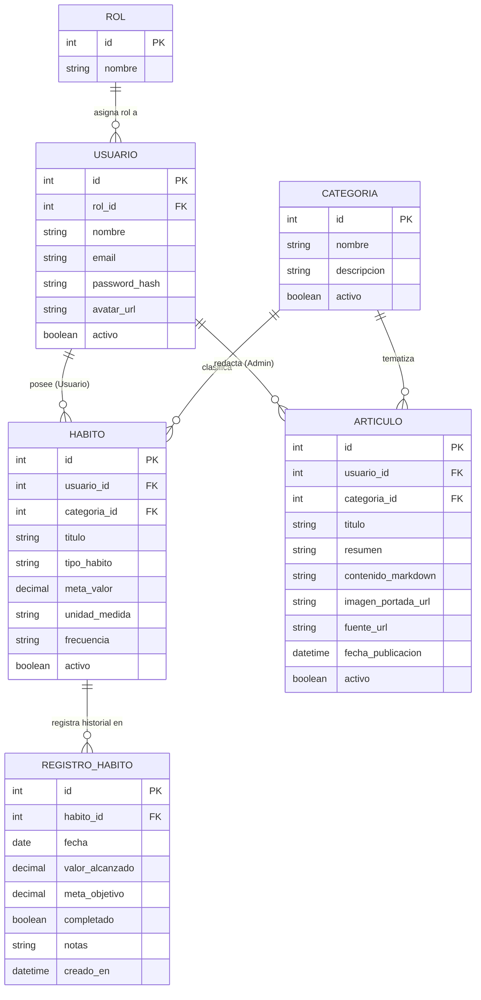

# Propuesta: Habit & Consistency Tracker (Hub de Hábitos)

Propuesta de proyecto final orientada a la promoción de la asignatura, estructurada sobre una arquitectura desacoplada y lista para ser validada con la cátedra.

---

## 1. Ficha Técnica

| Parámetro | Detalle |
|---|---|
| **Nombre tentativo** | HabitHub / Consistency Tracker |
| **Tipo de Sistema** | Plataforma web de seguimiento de hábitos, cadencia personal y blog de ciencia de hábitos |
| **Backend** | ASP.NET Core WebAPI (.NET 10) |
| **Frontend** | SvelteKit SPA (modo cliente con `@sveltejs/adapter-static`) |
| **Base de Datos** | MySQL 8.0 (acceso relacional con Repository Pattern) |
| **Autenticación** | JWT (JSON Web Tokens) con roles (`Administrador`, `Usuario`) |
| **Alcance temporal** | MVP ejecutable en `localhost` para la defensa técnica (06/11/2026) |

---

## 2. Problemática y Justificación

### El Problema
Las herramientas actuales de productividad fallan en los extremos:
- **Gestores to-do genéricos (Google Tasks, Todoist):** tratan a los hábitos como tareas descartables; no comprenden cadencia, frecuencia ni rachas acumulativas.
- **Documentación libre (Notion, Obsidian):** introducen demasiada fricción operativa y pasos para registrar un hábito cotidiano de 2 segundos.
- **Apps comerciales dedicadas:** en su mayoría imponen modelos de suscripción abusivos ($40-60 USD/anuales), bloatware, o esquemas de gamificación infantil que distraen del foco.
- **Falta de contexto:** exigen registrar hábitos mecánicamente sin brindar información sobre cómo construirlos y sostenerlos de forma efectiva.

### La Solución
Un sistema centralizado, minimalista y libre de fricción enfocado en la **consistencia y el conocimiento**:
- Hábitos configurables tanto cuantitativos (ej. tomar 8 vasos de agua, leer 20 páginas) como cualitativos/booleanos (ej. meditar, entrenar).
- Hábitos de reducción o abstinencia (*quit habits*, contador de días limpios).
- Visualización mediante un **heatmap de consistencia** (estilo gráfico de actividad de GitHub) e informes periódicos (semanales y mensuales).
- **Módulo de Ciencia del Hábito (Blog/Artículos):** espacio donde el Administrador publica artículos periódicos sobre bienestar, sueño, foco y mindfulness, con enlace directo a la fuente o estudio original.

---

## 3. Alcance y Límites del MVP

### Dentro del Alcance (MVP para Promoción)
- **Autenticación y Seguridad:** Registro, login por JWT, roles diferenciados (`Administrador` y `Usuario`), y gestión de avatar con subida y validación de imagen.
- **Gestión de Hábitos y Categorías:** ABM completo de Categorías (Salud, Estudio, Trabajo, etc.) y Hábitos (frecuencia, metas cuantitativas/booleanas).
- **Registro Diario (*Check-in*):** Actualización inmediata de valores diarios y notas breves de reflexión (sin fricción de subida de archivos).
- **Visualización y Métricas:** Dashboard diario (*Today*) con mini-heatmap semanal por tarjeta y visualización de consistencia histórica.
- **Módulo de Artículos / Ciencia del Hábito (Rol Admin):**
  - Publicación y mantenimiento de artículos educativos por parte del Administrador.
  - Editor en **Split-View** con redacción en Markdown a la izquierda y preview reactivo estilizado con `@tailwindcss/typography` a la derecha.
  - Subida y almacenamiento de **imagen de portada** en el servidor (cumpliendo el requerimiento de archivos de la cátedra de forma natural).
  - Enlace al recurso o estudio externo original (`fuente_url`).
  - Feed de lectura para usuarios con acceso público autenticado.
- **Búsqueda y Paginación:** Búsqueda asíncrona (AJAX) para vincular categorías/hábitos y paginado server-side para listados históricos de logs y artículos.

### Fuera de Alcance (Deliberadamente no contemplado)
- Integración de widgets nativos de sistema operativo.
- Planificador horario o calendario de agenda tipo Google Calendar.
- Temporizadores pomodoro integrados (se delega en herramientas dedicadas de escritorio como Pomody).
- Notificaciones push móviles nativas (quedan reservadas para la etapa móvil).

---

## 4. Modelo de Datos y Entidades

El modelo consta de **6 tablas estructuradas** (2 de autenticación y 4 de dominio puro), garantizando solidez conceptual sin sobrecarga:

### Descripción de Entidades:
1. **`Rol` & `Usuario`:** Autenticación por JWT, roles (`Administrador` y `Usuario`), avatar de perfil con subida de imagen al servidor.
2. **`Categoria`:** Clasificador de dominio limpio (`id`, `nombre`, `descripcion`, `activo`). Una misma categoría (ej. *"Sueño & Recuperación"*, *"Foco Profundo"*) agrupa tanto hábitos personales como artículos educativos.
3. **`Habito`:** Define la regla del hábito (booleano, cuantitativo o abstinencia; valor meta, unidad y frecuencia).
4. **`RegistroHabito` / `CheckIn`:** Registro diario ágil con valor alcanzado, estado de completitud, notas de reflexión y fecha.
5. **`Articulo`:** Publicación educativa redactada exclusivamente por el Administrador, con soporte de **imagen de portada** subida al servidor y enlace al estudio/fuente original.

---

## 5. Mapeo contra Requerimientos Mínimos de la Cátedra

| Requerimiento Cátedra | Cómo se resuelve en este proyecto |
|---|---|
| **Al menos 4 tablas relacionadas (1 a N)** | Se implementan 6 tablas: `Rol -> Usuario`, `Categoria -> Habito`, `Habito -> RegistroHabito`, `Categoria -> Articulo`, `Usuario -> Articulo`. |
| **Seguridad con login, roles, `Authorize` y avatar** | Autenticación con JWT Bearer. Rol `Administrador` exclusivo para redactar/gestionar artículos y administrar categorías; rol `Usuario` para gestionar sus hábitos privados y leer artículos. Avatar con subida y validación. |
| **Manejo de archivos adicional al avatar** | La entidad `Articulo` implementa subida y almacenamiento de **imágenes de portada**, con validación de tipo MIME y tamaño en el backend ASP.NET Core, resolviendo el requisito de manera orgánica sin sobrecargar al usuario diario. |
| **Al menos un CRUD en framework frontend vía AJAX** | Toda la SPA está construida en SvelteKit; todos los CRUDs (Categorías, Hábitos, Check-ins, Artículos) se gestionan por peticiones HTTP asíncronas vía `fetch` a la WebAPI. |
| **Listados con paginado en servidor** | Historiales de check-ins y listados de artículos se sirven mediante endpoints paginados en backend (`pageNumber`, `pageSize`, `totalRecords`). |
| **Búsqueda vía AJAX de entidades relacionadas** | Al crear hábitos o artículos, la selección de categorías y filtros utiliza autocompletado asíncrono consultando a la API con parámetros de búsqueda. |
| **Uso de API con JWT** | La SPA consume la API mediante cabeceras `Authorization: Bearer <token>`. Se incluye la colección de Postman/Thunder Client con endpoints autenticados y variables de entorno. |

---

## 6. Módulos y Pantallas del Frontend (SvelteKit)

1. **Dashboard Diario (Vista Principal - *Today*):**
   - Tarjetas apiladas uniformes con mini-heatmap semanal (últimos 7 días) y stepper/toggle directo.
   - Flujo rápido sin fricción para marcar progreso diario.
2. **Gestión de Hábitos y Categorías (*Habits*):**
   - Listado general y configuración de hábitos activos/archivados.
   - Alta/edición de hábito con selector de categoría vía búsqueda asíncrona.
   - Vista de detalle con heatmap histórico extendido.
3. **Ciencia del Hábito y Lecturas (*Articles*):**
   - Feed de artículos educativos en tarjetas con portada, categoría, resumen y enlace a fuente.
   - Vista de lectura completa (`/articulos/[id]`).
   - *(Solo Administrador)*: Pantalla de redacción con **Editor Split-View** (Markdown a la izquierda, preview formateado a la derecha) y selector de imagen de portada.
4. **Perfil y Configuración:**
   - Edición de perfil, cambio de contraseña y subida/recorte de avatar.
5. **Panel de Gestión de Categorías y Usuarios (Solo Admin):**
   - ABM de categorías globales y control de estado de usuarios (baja lógica).

---

## 7. Proyección y Reutilización Futura

- **Integración con Pomody:** La WebAPI queda lista para recibir en el futuro peticiones autenticadas desde el cliente de escritorio Pomody al completar bloques de enfoque vinculados a un hábito de estudio o programación.
- **Base para Trabajo Final (Móvil):** La arquitectura desacoplada permite que la misma WebAPI sirva como backend para la aplicación Android en la materia del año próximo, reduciendo el trabajo de graduación a la construcción exclusiva de la interfaz móvil.
