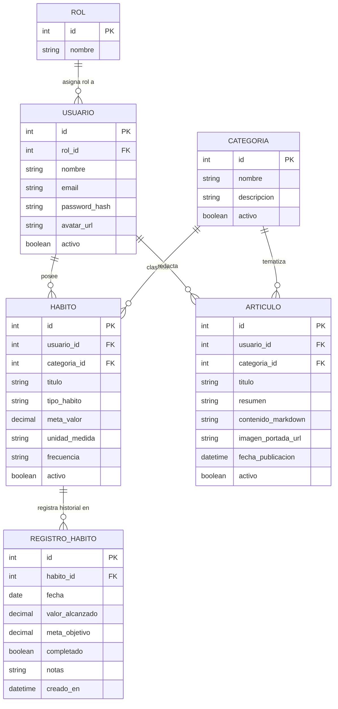

# Propuesta: Habit Tracker & Blog

Especificación técnica de la propuesta de proyecto final para la asignatura.

---

## 1. Ficha Técnica

| Parámetro | Detalle |
|---|---|
| **Sistema** | Habit Tracker con módulo editorial de artículos |
| **Backend** | ASP.NET Core WebAPI (.NET 10) |
| **Frontend** | SvelteKit SPA (`adapter-static`, modo cliente) |
| **Base de Datos** | MySQL 8.0 |
| **Autenticación** | JWT (roles `Administrador` y `Usuario`) |
| **Evaluación** | Ejecución local (`localhost`) + defensa técnica |

---

## 2. Descripción del Sistema

Aplicación web para gestión de hábitos personales (diarios, cuantitativos y booleanos) con visualización de consistencia histórica mediante heatmaps. Incluye un módulo editorial donde el rol Administrador publica artículos breves en Markdown con imagen de portada.

---

## 3. Alcance (MVP)

### Incluido
- Registro, login con JWT y avatar de usuario (subida de imagen).
- CRUD de Categorías y Hábitos.
- Check-in diario de hábitos (valor alcanzado y notas).
- Visualización de consistencia: mini-heatmap semanal por tarjeta y vista histórica en detalle.
- Módulo de Artículos (rol Administrador): alta/edición en Markdown (editor split-view con preview) y subida de imagen de portada.
- Lectura de artículos para usuarios autenticados.
- Paginación en servidor (logs de hábitos y catálogo de artículos).
- Búsqueda asíncrona (AJAX) para asociar categorías a hábitos y artículos.

### Excluido
- Widgets de sistema operativo.
- Calendario / agenda horaria.
- Temporizadores pomodoro.
- Notificaciones push.

---

## 4. Modelo de Datos

---

## 5. Cumplimiento de Requerimientos de Cátedra

| Requerimiento Cátedra | Implementación en el Proyecto |
|---|---|
| **Mínimo 4 tablas relacionadas (1 a N)** | 6 tablas: `Rol -> Usuario`, `Categoria -> Habito`, `Habito -> RegistroHabito`, `Categoria -> Articulo`, `Usuario -> Articulo`. |
| **Seguridad: login, roles, `Authorize` y avatar** | JWT Bearer. Rol `Administrador` gestiona categorías y publica artículos; rol `Usuario` gestiona sus hábitos y lee artículos. Subida de avatar con validación. |
| **Manejo de archivos adicional al avatar** | Subida y almacenamiento de imágenes de portada en la entidad `Articulo` (gestión exclusiva del Administrador). |
| **Al menos un CRUD vía AJAX en framework frontend** | Toda la SPA está en SvelteKit; todos los CRUDs operan vía `fetch` asíncrono contra la WebAPI. |
| **Listados con paginado en servidor** | Endpoints de historial de check-ins y listado de artículos paginados (`pageNumber`, `pageSize`, `totalRecords`). |
| **Búsqueda AJAX de entidades relacionadas** | Autocompletado asíncrono para vincular categorías al crear/editar hábitos o artículos. |
| **API con JWT** | Consumo natural y directo desde la SPA mediante cabeceras Bearer. |

---

## 6. Vistas de la SPA (SvelteKit)

- **/today**: Listado diario de hábitos con stepper/toggle directo y mini-heatmap de los últimos 7 días.
- **/habits**: Listado general y estado de hábitos (activos/archivados).
- **/habits/[id]**: Detalle individual con heatmap histórico completo, métricas de racha y edición de la regla.
- **/articles**: Catálogo de artículos con portada, título y resumen.
- **/articles/[id]**: Lectura del artículo en Markdown renderizado.
- **/articles/nuevo** (Admin): Editor split-view (Markdown + preview) con selector de imagen de portada.
- **/admin/categorias** (Admin): CRUD de categorías del sistema.
- **/perfil**: Datos personales y cambio de avatar.

---

## 7. Detalle de Campos: Hábitos vs. Registros

### `HABITO` (Definición / Regla)
- `usuario_id`: Dueño del hábito.
- `categoria_id`: Categoría asociada.
- `titulo`: Nombre del hábito.
- `tipo_habito`: `'cuantitativo'` (usa stepper), `'booleano'` (usa switch), o `'abstinencia'` (contador de días).
- `meta_valor`: Valor objetivo (ej. 8 vasos, 20 páginas, 1 para booleano).
- `unidad_medida`: Texto de unidad (ej. "vasos", "páginas"; null en booleanos).
- `frecuencia`: Cadencia esperada (ej. `'diaria'`).
- `activo`: Baja lógica (permite archivar hábitos sin perder estadísticas históricas).

### `REGISTRO_HABITO` (Ejecución Diaria / Check-in)
Restricción: `UNIQUE(habito_id, fecha)` (un registro por hábito por día).
- `habito_id`: Hábito asociado.
- `fecha`: Fecha calendario del check-in.
- `valor_alcanzado`: Progreso del día.
- `meta_objetivo`: Copia congelada de la meta a esa fecha (mantiene inmutabilidad histórica si la meta cambia a futuro).
- `completado`: Flag precalculado (`valor_alcanzado >= meta_objetivo`) para renderizar el heatmap sin recalcular en cada lectura.
- `notas`: Comentario breve opcional.
- `creado_en`: Timestamp de auditoría.
