# Estructura de Desglose de Trabajo (EDT / WBS)

Estructura jerárquica y secuencial de las tareas planificadas para el proyecto inmobiliario.

```mermaid
flowchart TD
    ROOT["Proyecto Inmobiliaria"]

    %% Fase 1: Análisis
    FASE1["1. Análisis y Requisitos"]
    ROOT --> FASE1
    FASE1_1["1.1 Definición general de Casos de Uso"]
    FASE1_2["1.2 Especificación detallada de cada Caso de Uso"]
    FASE1 --> FASE1_1
    FASE1 --> FASE1_2

    %% Fase 2: Diseño de Datos
    FASE2["2. Modelado y Persistencia"]
    ROOT --> FASE2
    FASE2_1["2.1 Diagrama Entidad-Relación (DER)"]
    FASE2_2["2.2 Script SQL de creación e inicialización de BD"]
    FASE2 --> FASE2_1
    FASE2 --> FASE2_2

    %% Fase 3: Documentación y Setup
    FASE3["3. Configuración y Documentación"]
    ROOT --> FASE3
    FASE3_1["3.1 Actualización de README.md"]
    FASE3_1_1["3.1.1 Instrucciones para levantar e inicializar BD"]
    FASE3_1_2["3.1.2 Instrucciones para ejecutar la aplicación"]
    FASE3 --> FASE3_1
    FASE3_1 --> FASE3_1_1
    FASE3_1 --> FASE3_1_2

    %% Fase 4: Desarrollo Primera Entrega
    FASE4["4. Desarrollo: Primera Entrega"]
    ROOT --> FASE4
    FASE4_1["4.1 Configuración de conexión y capa de datos"]
    FASE4_2["4.2 ABM de Propietarios"]
    FASE4_3["4.3 ABM de Inquilinos"]
    FASE4_4["4.4 Validación de criterios de entrega"]
    FASE4 --> FASE4_1
    FASE4 --> FASE4_2
    FASE4 --> FASE4_3
    FASE4 --> FASE4_4

    %% Fase 5: Desarrollo Segunda Entrega
    FASE5["5. Desarrollo: Segunda Entrega"]
    ROOT --> FASE5
    FASE5_1["5.1 Migración SQL (tablas Inmueble, TipoInmueble, Reserva)"]
    FASE5_2["5.2 ABM de Tipo de Inmueble (CU-TI01–TI04)"]
    FASE5_3["5.3 ABM de Inmuebles (CU-I01–I05)"]
    FASE5_4["5.4 Suspender / reactivar inmueble (CU-I05)"]
    FASE5_5["5.5 Vista detalle de Propietario con sus Inmuebles (CU-P05 + CU-I06)"]
    FASE5_6["5.6 ABM de Reservas (CU-R01–R04)"]
    FASE5_7["5.7 Cancelación anticipada con multa (CU-R05)"]
    FASE5_8["5.8 Extensión de Reserva (CU-R06)"]
    FASE5_9["5.9 Validación de no superposición de fechas"]
    FASE5_10["5.10 Validación de criterios de entrega"]
    FASE5 --> FASE5_1
    FASE5 --> FASE5_2
    FASE5 --> FASE5_3
    FASE5 --> FASE5_4
    FASE5 --> FASE5_5
    FASE5 --> FASE5_6
    FASE5 --> FASE5_7
    FASE5 --> FASE5_8
    FASE5 --> FASE5_9
    FASE5 --> FASE5_10
```

## Secuencia y Dependencias

```mermaid
flowchart LR
    CU["Casos de Uso"] --> DET_CU["Detalle de Casos de Uso"]
    DET_CU --> DER["Diagrama Entidad-Relación"]
    DER --> SQL["Script SQL (Creación / Init)"]
    SQL --> DOC["README (Setup BD y Run App)"]
    DOC --> DEV1["Primera Entrega (ABM Propietarios e Inquilinos)"]
    DEV1 --> MIG["Migración SQL (Inmueble, TipoInmueble, Reserva)"]
    MIG --> DEV2_I["ABM Inmuebles + Tipos"]
    DEV2_I --> DEV2_R["ABM Reservas + Operaciones"]
    DEV2_R --> DEV2_VAL["Validación Segunda Entrega"]
```

## Detalle de Paquetes de Trabajo

| Código | Tarea | Entregable / Resultado |
| :--- | :--- | :--- |
| **1.1** | Definición de Casos de Uso | Lista de casos de uso y actores identificados. |
| **1.2** | Detalle de Casos de Uso | Plantillas con flujos principales, alternativos y pre/postcondiciones. |
| **2.1** | Diagrama Entidad-Relación (DER) | Modelo conceptual/lógico con entidades, atributos y relaciones. |
| **2.2** | Script SQL | Archivo `.sql` reproducible para creación de tablas y datos semilla. |
| **3.1** | Setup en [README.md](README.md) | Guía paso a paso para levantar BD y correr la app ASP.NET Core. |
| **4.0** | [Primera Entrega](entregas-y-revisiones/primera-entrega.md) | ABM funcional de Propietarios e Inquilinos con ASP.NET MVC. |
| **5.1** | Migración SQL | Tablas `TipoInmueble`, `Inmueble` y `Reserva` en `database.sql`. |
| **5.2** | ABM Tipo de Inmueble | CU-TI01–TI04: repositorio, controller y vistas Razor. |
| **5.3** | ABM Inmuebles | CU-I01–I04: repositorio, controller, vistas (índice, alta, edición, detalle). |
| **5.4** | Suspender / reactivar Inmueble | CU-I05: acción de toggle de estado sin afectar reservas vigentes. |
| **5.5** | Detalle de Propietario con Inmuebles | CU-P05 + CU-I06: vista de detalle que lista los inmuebles del propietario. |
| **5.6** | ABM Reservas | CU-R01–R04: repositorio, controller, vistas (listados, alta, detalle). |
| **5.7** | Cancelación anticipada con multa | CU-R05: cálculo de multa según porcentaje transcurrido y registro de pago. |
| **5.8** | Extensión de Reserva | CU-R06: genera nueva reserva vinculada sin mutar la original. |
| **5.9** | Validación de no superposición | Lógica en repositorio que impide reservas con fechas solapadas para el mismo inmueble. |
| **5.10** | [Segunda Entrega](entregas-y-revisiones/segunda-entrega.md) | Validación final: menú de navegación, estilos, gitignore, DER y BD actualizados. |
