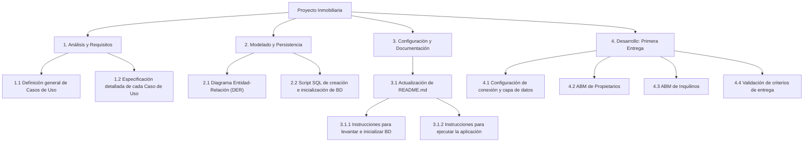
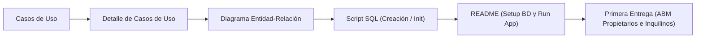

# Estructura de Desglose de Trabajo (EDT / WBS)

Estructura jerárquica y secuencial de las tareas planificadas para el proyecto inmobiliario.

## Secuencia y Dependencias

## Detalle de Paquetes de Trabajo

| Código | Tarea | Entregable / Resultado |
| :--- | :--- | :--- |
| **1.1** | Definición de Casos de Uso | Lista de casos de uso y actores identificados. |
| **1.2** | Detalle de Casos de Uso | Plantillas con flujos principales, alternativos y pre/postcondiciones. |
| **2.1** | Diagrama Entidad-Relación (DER) | Modelo conceptual/lógico con entidades, atributos y relaciones. |
| **2.2** | Script SQL | Archivo `.sql` reproducible para creación de tablas y datos semilla. |
| **3.1** | Setup en [README.md](README.md) | Guía paso a paso para levantar BD y correr la app ASP.NET Core. |
| **4.0** | [Primera Entrega](entregas-y-revisiones/primera-entrega.md) | ABM funcional de Propietarios e Inquilinos con ASP.NET MVC. |
