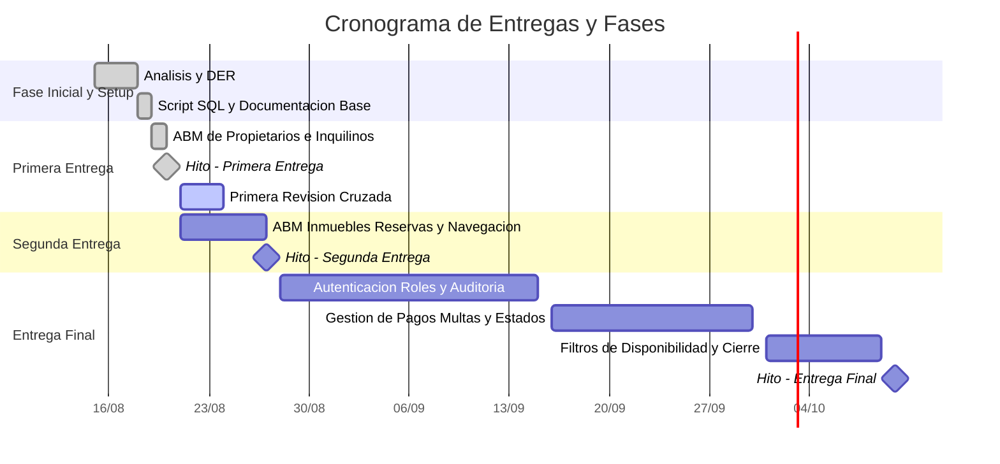

# Cronograma del Proyecto (Diagrama de Gantt)

Diagrama temporal basado en las fechas tentativas estipuladas para las entregas y revisiones del proyecto.

## Referencias de Hitos y Entregas

| Hito / Actividad | Fecha Tentativa | Entregables Principales |
| :--- | :--- | :--- |
| [**Primera Entrega**](../entregas-y-revisiones/primera-entrega.md) | `2026-08-20` | Repositorio base, DER, Script SQL, README, ABM Propietarios e Inquilinos. |
| [**Primera Revisión**](../entregas-y-revisiones/primera-revision.md) | Post-entrega | Informe técnico de revisión cruzada entre grupos. |
| [**Segunda Entrega**](../entregas-y-revisiones/segunda-entrega.md) | `2026-08-27` | ABM Inmuebles y Reservas/Contratos, Vistas de Detalle, Menú y estilos. |
| [**Entrega Final**](../entregas-y-revisiones/entrega-final.md) | `2026-10-10` | Auth (Login/Roles), Pagos/Multas, Consultas/Filtros, Auditoría y entrega final completa. |
